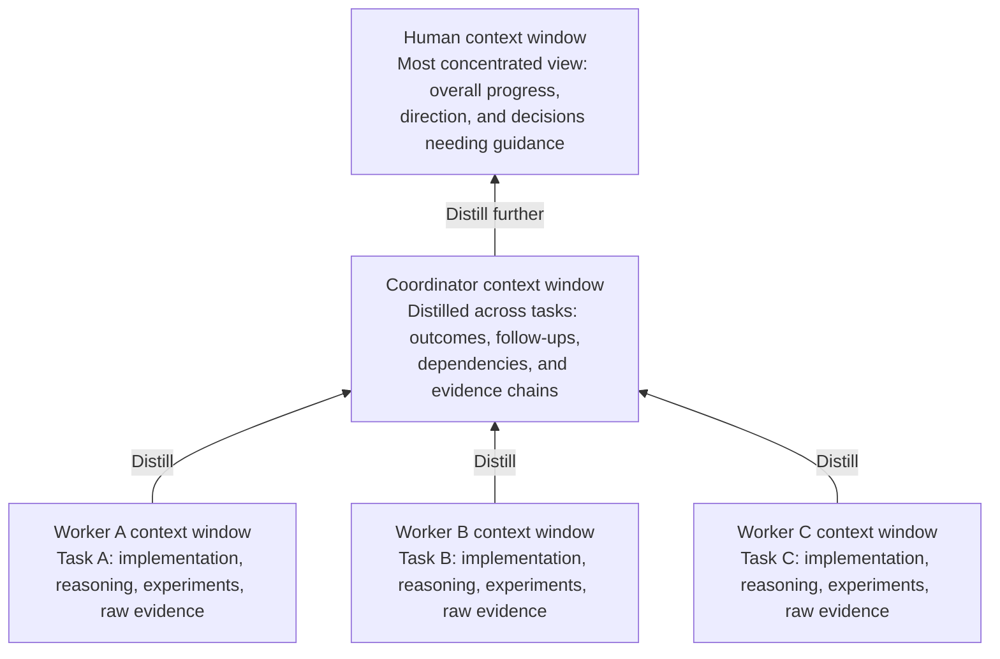
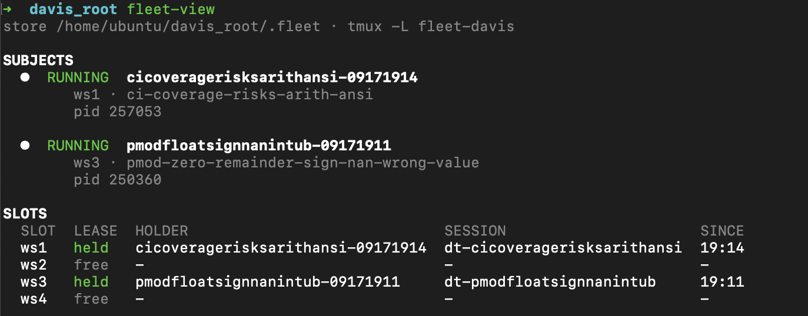

# Closing the Loop on My Coding Workflow

Coding agents have made it possible to run several streams of engineering work at once. The attention I have to make sense of that work hasn't grown with them.

Every stream produces decisions, dependencies, and results to verify. Eventually, adding more agents stops translating into more progress: everything is waiting on the same human.

Here is the first principle: take the human out of the loop. I started building Fleet to scale productivity beyond the limits of my own attention. The bigger lever is freeing up human bandwidth to improve the system doing the work, so each improvement creates room for the next and productivity gains compound.

## Load-test your own attention

Imagine turning up the concurrency until another agent no longer makes the project move faster. Then watch what you're actually doing.

- **Reloading context.** Jump between sessions, remember what each one owns, and recover the reasoning behind the last decision. Your morning starts with a tour of yesterday's conversations.
- **Decoding “done.”** It came with three follow-ups and a small change to the meaning of “done.” Now you ask for a self-contained brief—or read the session history and assemble one yourself.
- **Rediscovering old problems.** A session has been running for twenty hours. An issue surfaced early, got buried as context shifted, and is now being discovered again. It feels new to the agent. It feels very familiar to you.
- **Auditing the victory speech.** Did the task meet its goal? Which test proves it? Can you reproduce the result? What assumptions and open issues are hiding behind that confident final paragraph?
- **Playing scheduler.** Wait for a task, digest its findings, discover a dependency nobody knew about, and dispatch the next task. Repeat whenever another worker finishes.

That's the load test that matters to me. It reveals where my attention is doing work the system could learn to carry.

Fleet grew out of that exercise. It combines orchestration tools with skills I've added or adapted in my Superpowers fork, built around one central abstraction: the task workspace.

## A task context interface

In the usual workflow, we deliver code and ask someone to review it. **The code becomes the interface:** a large, raw artifact the reviewer has to distill into understanding. Human or agent, they still need to trace behavior, search for context, run commands, and assemble the evidence behind “this works.”

Fleet **eagerly materializes the evidence chain alongside the code**. During execution, the agent captures the relevant results and connects them to the requirements, reasoning, and assumptions. The handoff includes the concise explanation a reviewer would otherwise have to construct, with each claim pointing to its supporting evidence.

That's what I mean by a **context interface**. The reviewer starts with the assembled case and spends attention judging whether it holds. The design target is **zero reconstruction**: enough information to assess the result by reading, without first doing the detective work needed to make it reviewable.

Every task exposes the same structure. Here's a simplified view:

```text
task/
├── HANDOFF.md       # Start here: result, current state, links to the proof
├── CHARTER.md       # Starting point, promised outcome, acceptance criteria
├── DECISIONS.md     # What we chose and why
├── ASSUMPTIONS.md   # What still rests on an unverified belief
├── ISSUES.md        # Open problems and where they go next
├── RUNBOOK.md       # Exact commands to reproduce the results
├── investigations/ # Root cause analyses with cited causal chains
└── evidence/       # Captured test results and raw artifacts, with provenance
```

The structure stays predictable as the task evolves. Each fact has one home, current state is updated in place, and earlier decisions retain their history. Evidence records which code version produced it, so yesterday's passing test doesn't quietly become today's proof.

Supporting skills put this contract into practice. My revised systematic debugging skill requires an archived root cause analysis with cited facts and labeled assumptions; workspace review checks that the delivered work and its evidence satisfy the original goal.

## Let the coordinator carry the clipboard

The workspace also changes how much context the coordinator needs to carry. Workers generate plenty of implementation detail: code paths, experiments, logs, failed attempts. Their workspaces distill that into what matters to the roadmap: what was achieved, what remains open, what depends on it, and the evidence behind those conclusions.

The coordinator keeps that project-level view in its working context, with direct paths into the detail when a decision needs it. Its context budget can cover more of the project because each task arrives as a compact, informative account.



I can give it guidelines such as: investigate the biggest uncertainty early, keep independent work moving, and sequence tasks that touch the same code. It uses those priorities alongside dependencies and worker scopes to choose the next wave. Discoveries feed back into the plan.

With monitoring configured, the coordinator can observe workers and communicate with them, harvest completed task workspaces, reconcile findings, and dispatch newly ready work within those guidelines. Each result updates the project view and helps determine what runs next.

That's how I design for work that runs for days or weeks: keep the coordinator's active context focused on the roadmap, while durable workspaces retain the supporting detail. The coordination loop can continue across session restarts by picking up that recorded state. Superpowers' planning, debugging, review, and verification skills provide the routines; Fleet connects them through a persistent, auditable workflow.

Each task workspace is called an **instant**. The coordinator is an instant too, with its own roadmap and persistent context. An effort typically looks like this:

```text
effort/instants/
├── 00000000-09171000-inflight-append-coordinator/
│   └── .fleet/
│       └── roadmap.json
├── 00000000-09171005-complete-append-apiInvestigation/
├── 09171005-09171030-inflight-append-apiUpdate/
└── 09171005-09171031-inflight-append-clientUpdate/
```

Completed work stays alongside active work, so the next task can pick up the findings that led to it.



*The `fleet-view` overview: a view of the work, without a tour of every conversation.*

I can still use `tmux attach` on the fleet's tmux server to jump into any worker's coding session and interact the usual way: ask questions, steer the implementation, or work through a problem together.

My role becomes closer to managing the effort: review overall progress, set direction, and resolve the decisions that need my judgment. For me, the most valuable engineering here is controlling how information is distilled, transformed, and passed between those layers. My own working memory is the most expensive context window in the system. Each layer should do enough work that what reaches me earns its place there.

## The system that makes the progress should become better every hour

The workspace records and chat histories also tell me where Fleet itself needs work. My own messages are useful data: every repeated clarification, request for proof, or reminder about the goal is feedback about the system.

An agent can inspect that history, identify a recurring pattern, and work on the improvement as an ordinary development task: define the desired behavior, revise the skill or tooling, test it, and release it.

Take debugging. If I keep asking, “Which log line supports that explanation?”, the improvement is a rule that makes evidence part of the investigation from the start. That's why I revised the debugging skill to capture raw artifacts, label assumptions, and archive the causal chain. The next investigation starts with that expectation already in place.

Fleet's CI/CD pipeline gives those changes a tested release path, with verification and rollback. A corner case spotted in one task can become a skill improvement available to subsequent tasks. The turnaround I'm aiming for is an issue this hour informing how the next hour's work runs.

That is the bigger lever for me. A correction helps one task. Feeding it back into the shared workflow can help every task that follows.

I want to spend my attention on decisions worth making—and on making fewer of the same decisions twice.

If you want to try it, the code and a step-by-step bootstrap guide are in the [Fleet branch of my Superpowers fork](https://github.com/Davis-Zhang-Onehouse/superpowers/tree/live#fleet-quickstart).
