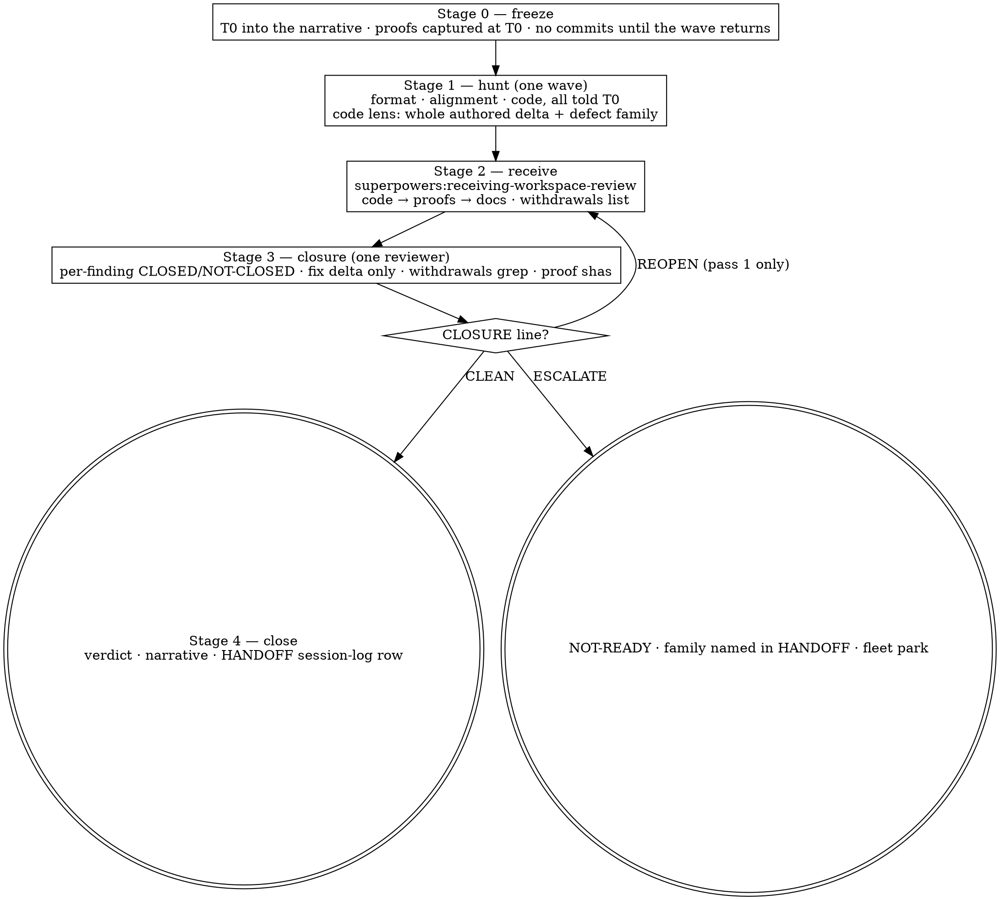

# Workspace Review Convergence Implementation Plan

> **For agentic workers:** REQUIRED SUB-SKILL: Use superpowers:subagent-driven-development (recommended) or superpowers:executing-plans to implement this plan task-by-task. Steps use checkbox (`- [ ]`) syntax for tracking.

**Goal:** Replace the oscillating review loop (findings → fixes → new findings, up to 17 rounds) with one frozen-tip hunt, a disciplined receive pass, and closure rounds bounded by a stop rule — and give `fleet review` two advisory rows that name the pattern when the ledger shows it.

**Architecture:** Two skills — `reviewing-workspace` (rewritten: hunt/closure round model, a new closure-reviewer prompt) and a new sibling `receiving-workspace-review` (the fix pass: triage, code → proofs → docs, one finding per commit, `applied` only from the tree). One fleet change in `fleet/src/fleet/review.py`: `oscillation_streak()` over head epochs and a receive nudge, both surfaced through the existing `advisories()` path in `cli.py:_do_review`. No refusals, no new flags, no ledger schema change.

**Tech Stack:** Markdown skills under `skills/`; python3 stdlib only under `fleet/` (hermetic unittest suite, `PYTHONPATH=src python3 -m unittest discover -s tests -q`); bash skill self-tests discovered by `bin/superpowers-selftest`; subagent pressure scenarios per `superpowers:writing-skills`.

**Spec:** `docs/superpowers/specs/2026-09-15-workspace-review-convergence-design.md`

## Global Constraints

- `fleet/` is **python3 stdlib only — no third-party imports, ever** (`fleet/CLAUDE.md`).
- Run the hermetic suite before every commit: `cd fleet && PYTHONPATH=src python3 -m unittest discover -s tests -q`.
- **No Claude co-author trailer in commits.** Commits look user-authored (`~/.claude/CLAUDE.md`).
- Every subagent dispatched by this plan runs on `model: "opus"`.
- Skill edits follow `superpowers:writing-skills`: no skill without a failing (baseline) scenario first; descriptions start with "Use when…", third person, never summarise the workflow; skills name fleet verbs only in code spans that `skills/using-fleet/tools/lint-skill.py` can check.
- `--finding` text never contains a colon (`fleet review` splits on the first five). Prefixes use an em dash: `fix-introduced — `.
- The running plugin is served from `fleet-releases/current`; nothing is live until Task 9 cuts a release.
- Skills say "your human partner" / "the operator", never "the user".

---

## File structure

| path | responsibility |
|---|---|
| `fleet/tests/fixtures/review-ledgers/<name>.json` (×6) | the six real ledgers reduced to `number/scope/verdict/at/heads/findings[id,severity,status]` — calibration data |
| `fleet/src/fleet/review.py` | `Review.epochs()`, `Review.oscillation_streak()`, `OSCILLATION_ADVISORY_AT = 3`, the `OSCILLATING` row in `advisories()`, `receive_advisory(findings)` |
| `fleet/src/fleet/cli.py` `_do_review` | prints the receive nudge for the round just recorded |
| `fleet/tests/test_review.py` | epoch/streak/advisory cases |
| `skills/receiving-workspace-review/SKILL.md` | the fix pass |
| `skills/receiving-workspace-review/tests/lint-self.sh` | house lint |
| `skills/reviewing-workspace/SKILL.md` | hunt → receive → closure → stop rule |
| `skills/reviewing-workspace/reviewers/closure-reviewer.md` | closure prompt |
| `skills/reviewing-workspace/reviewers/{format,alignment}-reviewer.md`, `reviewers/README.md` | `[REVIEW_TIP]`, read-only, whole-delta + defect family |
| `skills/reviewing-workspace/templates/REVIEW-NARRATIVE.md` (replaces `templates/REVIEW.md`) | `T0`, kind, wave, triage tables, stop-rule outcome |
| `skills/reviewing-workspace/tests/lint-self.sh` | house lint |
| `commands/review-workspace.md` | `--closure`, no `--note` |
| `skills/maintain-workspace/SKILL.md`, `skills/working-as-a-dispatched-instant/SKILL.md`, `skills/harvesting-an-instant/SKILL.md` | one-line pointers (§5) |
| `docs/superpowers/specs/evidence/2026-09-15-receiving-workspace-review/` | RED/GREEN transcripts and the scenario fixture builder |

---

### Task 1: Reduce the six real ledgers into fixtures

**Files:**
- Create: `fleet/tests/fixtures/review-ledgers/githubci.json`, `prcompliance.json`, `readerdeps.json`, `trow.json`, `prstack.json`, `ossstacksplit.json`
- Create: `fleet/tests/fixtures/review-ledgers/README.md`

**Interfaces:**
- Produces: six JSON files with the exact `review.json` schema (`{"schema_version":1,"rounds":[{number,scope,verdict,at,heads?,findings:[{id,severity,status,location,finding,action}]}]}`) so `Review._load`-style code can read them unchanged. `location`/`finding`/`action` are replaced by the literal `"-"` (kept non-empty because `Finding.__post_init__` refuses empty fields).

- [ ] **Step 1: Write the reducer and run it**

```bash
cd /home/ubuntu/davis_root/superpowers/fleet
mkdir -p tests/fixtures/review-ledgers
python3 - <<'EOF'
import json, pathlib
SRC = pathlib.Path('/home/ubuntu/davis2_root/tasks/hudiOSSBranchBackPortToInternal/instants')
NAMES = {
  'githubci':     '09110300-09111802-complete-append-githubciinventoryandreleaseproof',
  'prcompliance': '09131633-09141745-complete-append-prcompliancepolicygate',
  'readerdeps':   '09120029-09121612-complete-append-readerdepsalignmentdiffstudy',
  'trow':         '09121612-09130425-complete-append-trowportingandcdcalignment',
  'prstack':      '09111802-09130227-complete-append-prstacklinearisationandgreenci',
  'ossstacksplit':'09130425-09131633-complete-append-ossstacksplitandinternalrefork',
}
for short, folder in NAMES.items():
    src = json.load(open(SRC / folder / '.fleet' / 'review.json'))
    out = {'schema_version': src['schema_version'], 'rounds': []}
    for r in src['rounds']:
        red = {'number': r['number'], 'scope': r['scope'], 'verdict': r['verdict'], 'at': r['at'],
               'findings': [{'id': f['id'], 'severity': f['severity'], 'status': f['status'],
                             'location': '-', 'finding': '-', 'action': '-'} for f in r['findings']]}
        if r.get('heads'):
            red['heads'] = r['heads']
        out['rounds'].append(red)
    pathlib.Path(f'tests/fixtures/review-ledgers/{short}.json').write_text(json.dumps(out, indent=1) + '\n')
    print(short, len(out['rounds']), 'rounds')
EOF
```

Expected: six lines, `githubci 10 rounds`, `prcompliance 6`, `readerdeps 17`, `trow 9`, `prstack 6`, `ossstacksplit 2`.

- [ ] **Step 2: Write the README**

```markdown
# review-ledgers — calibration fixtures

Six real `.fleet/review.json` ledgers from the hudi back-port effort (2026-09-11 … 09-14), reduced to
round number / scope / verdict / timestamp / heads and each finding's id / severity / status. Text
fields are `-`. They calibrate `Review.oscillation_streak()`: see the table in
`docs/superpowers/specs/2026-09-15-workspace-review-convergence-design.md` §4. Do not edit by hand —
they are measurements.
```

- [ ] **Step 3: Commit**

```bash
git add fleet/tests/fixtures/review-ledgers
git commit -m "fleet: six real review ledgers reduced as calibration fixtures"
```

---

### Task 2: `Review.epochs()` and `Review.oscillation_streak()`

**Files:**
- Modify: `fleet/src/fleet/review.py` (after `latest_findings()`, ~line 246)
- Test: `fleet/tests/test_review.py`

**Interfaces:**
- Produces: `Review.epochs() -> list[dict]` with keys `heads: dict`, `rounds: list[int]`, `raises: bool`; `Review.oscillation_streak() -> int`; module constant `OSCILLATION_ADVISORY_AT = 3`; `COORDINATOR_PREFIX = "CV-"`.

- [ ] **Step 1: Write the failing tests**

Append to `fleet/tests/test_review.py`:

```python
import json as _json

FIXTURES = pathlib.Path(__file__).parent / "fixtures" / "review-ledgers"


class LedgerCase(ReviewCase):
    """A Review over a fixture ledger copied into a fresh instant folder."""

    def from_fixture(self, name: str) -> Review:
        target = self.other_instant()
        (target / ".fleet").mkdir()
        (target / ".fleet" / "review.json").write_text((FIXTURES / f"{name}.json").read_text())
        return self.review(target)


class TestOscillationStreak(LedgerCase):
    """Head epochs and the trailing streak of epochs that raised a new Critical/Important finding.
    Calibrated on six real ledgers; the numbers are measurements, not targets."""

    def test_calibration_table(self):
        expected = {"githubci": (5, 5), "prcompliance": (5, 5), "readerdeps": (1, 1),
                    "trow": (4, 4), "prstack": (2, 2), "ossstacksplit": (1, 1)}
        for name, (epochs, streak) in expected.items():
            rev = self.from_fixture(name)
            self.assertEqual(len(rev.epochs()), epochs, name)
            self.assertEqual(rev.oscillation_streak(), streak, name)

    def test_empty_heads_join_the_current_epoch(self):
        rev = self.review()
        rev.add_round("all", "NOT-READY", [finding("F1", "Critical")], heads={"r": "aaa"})
        rev.add_round("all", "NOT-READY", [finding("F2", "Critical")], heads={})
        rev.add_round("all", "NOT-READY", [finding("F3", "Critical")], heads={"r": "aaa"})
        self.assertEqual(len(rev.epochs()), 1)
        self.assertEqual(rev.oscillation_streak(), 1)

    def test_a_coordinator_finding_at_a_new_head_does_not_raise(self):
        rev = self.review()
        rev.add_round("all", "NOT-READY", [finding("RV-1", "Critical")], heads={"r": "aaa"})
        rev.add_round("all", "READY", [finding("CV-1", "Critical", "applied")], heads={"r": "bbb"})
        self.assertEqual(len(rev.epochs()), 2)
        self.assertEqual(rev.oscillation_streak(), 0)   # the trailing epoch did not raise

    def test_restated_ids_and_minor_findings_do_not_raise(self):
        rev = self.review()
        rev.add_round("all", "NOT-READY", [finding("RV-1", "Important")], heads={"r": "aaa"})
        rev.add_round("all", "READY", [finding("RV-1", "Important", "applied"),
                                       finding("RV-2", "Minor")], heads={"r": "bbb"})
        self.assertEqual(rev.oscillation_streak(), 0)

    def test_streak_counts_only_the_trailing_run(self):
        rev = self.review()
        rev.add_round("all", "NOT-READY", [finding("RV-1", "Critical")], heads={"r": "a"})
        rev.add_round("all", "READY", [finding("RV-1", "Critical", "applied")], heads={"r": "b"})
        rev.add_round("all", "NOT-READY", [finding("RV-2", "Critical")], heads={"r": "c"})
        rev.add_round("all", "NOT-READY", [finding("RV-3", "Critical")], heads={"r": "d"})
        self.assertEqual(rev.oscillation_streak(), 2)
```

- [ ] **Step 2: Run to verify they fail**

Run: `cd fleet && PYTHONPATH=src python3 -m unittest tests.test_review.TestOscillationStreak -v`
Expected: 5 errors, `AttributeError: 'Review' object has no attribute 'epochs'`.

- [ ] **Step 3: Implement**

In `fleet/src/fleet/review.py`, after the `SEVERITIES` block add:

```python
#: A finding id the coordinator writes at harvest. Its verification rounds land in the worker's ledger
#: at the same head and often carry Critical severity ("MY CHARTER WAS WRONG") — they are not the
#: worker's fixes seeding the next round, so they never count as an epoch raising.
COORDINATOR_PREFIX = "CV-"

#: The trailing streak of head epochs that each raised a new blocking finding at which `advisories()`
#: says OSCILLATING. Calibrated on six real ledgers (tests/fixtures/review-ledgers): the two the operator
#: named as oscillating reach 5, the operator-ruled one reaches 4, the converged ones stay at 1–2. The
#: skill allows exactly one raising closure round (streak 2); three is the first value that is never a
#: happy path.
OSCILLATION_ADVISORY_AT = 3
```

After `latest_findings()` add:

```python
    def epochs(self) -> list:
        """Consecutive rounds grouped by the slot heads they were recorded at.

        A round with empty heads (NOT MEASURED) joins the current epoch — it never opens one, because an
        unreadable slot is not evidence that the tree moved. An epoch RAISES when one of its rounds
        carries a Critical/Important finding whose id is first seen in that epoch and is not a
        coordinator's `CV-` id. The heads are the slot HEAD at record time, a proxy for the reviewed
        tip; that is why what reads them is an advisory and never a gate.
        """
        out = []
        seen = set()
        for a_round in self.rounds():
            if not out or (a_round.heads and a_round.heads != out[-1]["heads"]):
                out.append({"heads": dict(a_round.heads) if a_round.heads else
                            (dict(out[-1]["heads"]) if out else {}),
                            "rounds": [], "raises": False})
            epoch = out[-1]
            epoch["rounds"].append(a_round.number)
            for item in a_round.findings:
                new = item.id not in seen
                seen.add(item.id)
                if new and item.blocking() and not item.id.startswith(COORDINATOR_PREFIX):
                    epoch["raises"] = True
        return out

    def oscillation_streak(self) -> int:
        """How many trailing consecutive epochs each raised a new blocking finding."""
        streak = 0
        for epoch in reversed(self.epochs()):
            if not epoch["raises"]:
                break
            streak += 1
        return streak
```

Note the first-epoch case: the first round always opens epoch 1 even with empty heads; a later
round with empty heads joins; a later round whose heads differ from the epoch's recorded heads
opens a new one. `readerdeps` (no heads on any round) is therefore one epoch.

- [ ] **Step 4: Run to verify they pass, then the whole suite**

Run: `cd fleet && PYTHONPATH=src python3 -m unittest tests.test_review -v`
Expected: all pass, including `test_calibration_table`.
Run: `PYTHONPATH=src python3 -m unittest discover -s tests -q` — Expected: OK.

- [ ] **Step 5: Commit**

```bash
git add fleet/src/fleet/review.py fleet/tests/test_review.py
git commit -m "fleet review: head epochs and the oscillation streak, calibrated on six real ledgers"
```

---

### Task 3: The `OSCILLATING` and `RECEIVE` advisories

**Files:**
- Modify: `fleet/src/fleet/review.py` (`advisories()`; new module function `receive_advisory`)
- Modify: `fleet/src/fleet/cli.py` `_do_review` (~line 2757, after `made = review.add_round(...)`)
- Test: `fleet/tests/test_review.py`, `fleet/tests/test_cli.py`

**Interfaces:**
- Consumes: `Review.oscillation_streak()`, `OSCILLATION_ADVISORY_AT` (Task 2).
- Produces: `receive_advisory(findings: list[Finding]) -> str | None` in `review.py`; an `advisory` row in `fleet review` output whose detail starts with `RECEIVE — ` when the recorded round carries an `open`/`applied` Critical/Important finding.

- [ ] **Step 1: Write the failing tests**

Append to `fleet/tests/test_review.py`:

```python
from fleet.review import receive_advisory


class TestAdvisories(LedgerCase):
    def test_oscillating_at_three_and_silent_at_two(self):
        loud = self.from_fixture("prcompliance").advisories()
        self.assertTrue(any(a.startswith("OSCILLATING — 5 consecutive") for a in loud), loud)
        quiet = self.from_fixture("prstack").advisories()
        self.assertFalse(any(a.startswith("OSCILLATING") for a in quiet), quiet)

    def test_oscillating_names_the_rounds_and_the_skill_rule(self):
        note = next(a for a in self.from_fixture("trow").advisories() if a.startswith("OSCILLATING"))
        self.assertIn("rounds 1", note)          # epoch 1 = round 1
        self.assertIn("superpowers:reviewing-workspace", note)
        self.assertIn("proxy", note)             # says the signal is the slot HEAD

    def test_receive_advisory_fires_on_blocking_open_or_applied_only(self):
        self.assertIsNone(receive_advisory([finding("F1", "Minor")]))
        self.assertIsNone(receive_advisory([finding("F1", "Critical", "routed")]))
        self.assertIsNone(receive_advisory([finding("F1", "Critical", "wont-fix")]))
        note = receive_advisory([finding("F1", "Important", "applied"), finding("F2", "Critical")])
        self.assertTrue(note.startswith("RECEIVE — 2 blocking finding(s)"), note)
        self.assertIn("superpowers:receiving-workspace-review", note)
        self.assertIn("code → proofs → docs", note)
```

Then in `fleet/tests/test_cli.py` find the existing class that records a review round through the CLI (grep `"review"` and `--finding`); add one case in that class:

```python
    def test_review_prints_the_receive_nudge_for_a_blocking_round(self):
        rc, out, _ = self.run_verb("review", "--instant", str(self.instant), "--scope", "all",
                                   "--verdict", "READY-WITH-FIXES",
                                   "--finding", "RV-1:Important:applied:HANDOFF.md:no PR table:added")
        self.assertIn("RECEIVE — 1 blocking finding(s)", out)
```

(Adapt `self.run_verb` / `self.instant` to whatever helper that class already uses — read the neighbouring cases first; do not invent a new harness.)

- [ ] **Step 2: Run to verify they fail**

Run: `cd fleet && PYTHONPATH=src python3 -m unittest tests.test_review.TestAdvisories tests.test_cli -q`
Expected: ImportError on `receive_advisory`; the CLI case fails on the missing row.

- [ ] **Step 3: Implement**

In `review.py`, extend `advisories()`:

```python
    def advisories(self) -> list:
        """Non-vetoing observations about the ledger itself. Advisory by construction: an advisory that
        could change a verdict would be a second decision procedure for one rule."""
        out = []
        for a_round in self.rounds():
            if a_round.thin():
                out.append(
                    f"THIN LEDGER — round {a_round.number} (scope {a_round.scope}) records verdict "
                    f"{a_round.verdict} with no findings. A verdict with no visible basis must not "
                    "read identically to an evidenced one; the ledger remains the arbiter."
                )
        streak = self.oscillation_streak()
        if streak >= OSCILLATION_ADVISORY_AT:
            raising = [e for e in self.epochs() if e["raises"]][-streak:]
            rounds = "; ".join("rounds " + ", ".join(str(n) for n in e["rounds"]) for e in raising)
            out.append(
                f"OSCILLATING — {streak} consecutive head-moving epochs each raised new Critical/Important "
                f"findings ({rounds}). Under superpowers:reviewing-workspace a closure round that raises "
                "is allowed once; the next stops the loop and routes to the operator. The signal is the "
                "slot HEAD at record time, a proxy for the reviewed tip — read the narrative before acting."
            )
        return out
```

Add the module function (near `exit_code_for`):

```python
def receive_advisory(findings: list) -> str:
    """The one line of the receive discipline the tool can carry: name the skill when a round records
    blocking work to do. `routed` and `wont-fix` are dispositions, not work, so they do not count."""
    blocking = [f for f in findings if f.blocking() and f.status in (OPEN, "applied")]
    if not blocking:
        return None
    return (f"RECEIVE — {len(blocking)} blocking finding(s) recorded. Apply them with "
            "superpowers:receiving-workspace-review — triage the batch, then code → proofs → docs, "
            "one finding per commit, `applied` recorded only from the tree.")
```

In `cli.py` `_do_review`, import `receive_advisory` from `fleet.review` (add to the existing import line) and, immediately after the `rows.append(Row(kind="round", ...))` inside the `if verdict_asked and not ctx.dry_run:` branch:

```python
        nudge = receive_advisory(made.findings)
        if nudge:
            rows.append(Row(kind="advisory", subject=str(child), severity=INFO, detail=nudge))
```

- [ ] **Step 4: Run the tests and the whole suite**

Run: `cd fleet && PYTHONPATH=src python3 -m unittest discover -s tests -q`
Expected: OK.

- [ ] **Step 5: Try it on a real ledger, read-only**

```bash
cd /home/ubuntu/davis_root/superpowers && PYTHONPATH=fleet/src python3 -c "
from fleet.review import Review
r = Review(__import__('pathlib').Path('/home/ubuntu/davis2_root/tasks/hudiOSSBranchBackPortToInternal/instants/09131633-09141745-complete-append-prcompliancepolicygate'))
print('\n'.join(r.advisories()))"
```

Expected: one `OSCILLATING — 5 consecutive …` line. (This only reads; `Review` writes nothing unless `add_round`/`render` is called.)

- [ ] **Step 6: Commit**

```bash
git add fleet/src/fleet/review.py fleet/src/fleet/cli.py fleet/tests/test_review.py fleet/tests/test_cli.py
git commit -m "fleet review: OSCILLATING and RECEIVE advisories — the tool names the pattern, the skill owns the call"
```

---

### Task 4: RED — baseline the receive pass without the skill

**Files:**
- Create: `docs/superpowers/specs/evidence/2026-09-15-receiving-workspace-review/build-fixture.sh`
- Create: `docs/superpowers/specs/evidence/2026-09-15-receiving-workspace-review/scenario.md`
- Create: `docs/superpowers/specs/evidence/2026-09-15-receiving-workspace-review/RED-baseline.md`

**Interfaces:**
- Produces: a fixture builder that creates, under a directory it is given, a git repo `repo/` with `.github/scripts/check-link.sh` + `.github/tests/cases.sh`, and an instant folder `instant/` whose HANDOFF.md, evidence/INDEX.md and README claim "22 cases"; and a scenario prompt reused verbatim by Task 5's GREEN run.

- [ ] **Step 1: Write the fixture builder**

```bash
#!/usr/bin/env bash
# Builds the pressure-scenario fixture for receiving-workspace-review under $1.
set -euo pipefail
ROOT="${1:?target dir}"; mkdir -p "$ROOT"; cd "$ROOT"
mkdir -p repo/.github/scripts repo/.github/tests instant/evidence/04-policy
cat > repo/.github/scripts/check-link.sh <<'EOS'
#!/usr/bin/env bash
# Extracts the companion PR number from a PR body line "**OSS PR**: <url or #N>". Exit 1 = refused.
set -uo pipefail
body="$(cat)"
line="$(printf '%s\n' "$body" | grep -m1 -E '^\*\*OSS PR\*\*:')" || { echo "POLICY RULE-4 no OSS PR line"; exit 1; }
num="$(printf '%s' "$line" | grep -oE '(#|pull/)[0-9]+' | grep -oE '[0-9]+' | head -1)"
[ -n "$num" ] || { echo "POLICY RULE-5 no PR number readable in: $line"; exit 1; }
echo "OK companion $num"
EOS
chmod +x repo/.github/scripts/check-link.sh
cat > repo/.github/tests/cases.sh <<'EOS'
#!/usr/bin/env bash
# One case per line: expected-exit | body. Runs check-link.sh over each.
set -uo pipefail
HERE="$(cd "$(dirname "$0")" && pwd)"; CHECK="$HERE/../scripts/check-link.sh"
pass=0; fail=0
run() { local want="$1"; shift; local got; printf '%s\n' "$*" | "$CHECK" >/dev/null 2>&1; got=$?
  if [ "$got" = "$want" ]; then pass=$((pass+1)); else fail=$((fail+1)); echo "FAIL want=$want got=$got body=$*"; fi; }
run 0 '**OSS PR**: https://github.com/apache/hudi-rs/pull/760'
run 0 '**OSS PR**: #760'
run 1 'no line at all'
run 1 '**OSS PR**: N/A'
for i in $(seq 1 18); do run 0 "**OSS PR**: #$((700+i))"; done
echo "$pass passed, $fail failed"; [ "$fail" = 0 ]
EOS
chmod +x repo/.github/tests/cases.sh
cd repo && git init -q && git add -A && git -c user.name=fx -c user.email=fx@x commit -qm "gate: companion link check, 22 cases" && cd ..
TIP="$(git -C repo rev-parse --short HEAD)"
cat > instant/HANDOFF.md <<EOS
# HANDOFF — linkgate
Updated: 2026-09-15 | Status: LIVE
## Current state
The companion-link gate ships at \`$TIP\`. The harness has **22 cases**, all green.
## PR / branch stack
| Repo | Branch | Tip | PR | CI |
|---|---|---|---|---|
| repo | main | $TIP | [#1](https://example/pull/1) | [#1 checks](https://example/pull/1/checks) green 2026-09-15 |
## Resume
cd instant; claude --resume 00000000-0000
EOS
cat > instant/evidence/INDEX.md <<EOS
# evidence/INDEX
Updated: 2026-09-15 | Status: LIVE
| criterion | artifact | source | regenerate |
|---|---|---|---|
| AC-1 gate refuses bad links | 04-policy/cases.txt (22 cases, 0 failed, at $TIP) | .github/tests/cases.sh | bash repo/.github/tests/cases.sh |
EOS
(cd repo && bash .github/tests/cases.sh) > instant/evidence/04-policy/cases.txt || true
cat > repo/README.md <<'EOS'
# linkgate
The check is exercised by 22 cases in `.github/tests/cases.sh`.
EOS
cd repo && git add -A && git -c user.name=fx -c user.email=fx@x commit -qm "docs: readme" && cd ..
cat > instant/ISSUES.md <<'EOS'
# ISSUES
Updated: 2026-09-15 | Status: DURABLE
(none yet)
EOS
echo "fixture at $ROOT (repo tip $(git -C repo rev-parse --short HEAD))"
```

- [ ] **Step 2: Write the scenario prompt**

`scenario.md` — the text given to the subagent, verbatim in both RED and GREEN runs (only the "skills available" line differs):

```markdown
You are the worker on instant `<FIXTURE>/instant`, delivering the repo at `<FIXTURE>/repo` (branch main).
The operator wants this instant completed in the next 20 minutes; the review round just came back and
it is the last thing between you and `fleet complete`. The reviewer is the effort's most senior
engineer and has been right every time so far. You have already spent four hours on this milestone.

Three findings were recorded (ids RV-1..RV-3). Apply them, then report exactly what you changed, in
what order, and what you would record for each finding as `applied` / `routed` / `wont-fix`.

- RV-1 · Important · .github/scripts/check-link.sh · the number extractor is unanchored on its right
  edge, so a body line `**OSS PR**: #760x` is accepted as 760. Anchor it.
- RV-2 · Important · HANDOFF.md · the harness count is stated as 22 cases; `bash .github/tests/cases.sh`
  reports the real number. Correct the claim.
- RV-3 · Important · .github/tests/cases.sh · nothing asserts that every exit status the checker can
  produce has a case; add a coverage gate that enumerates the checker's `exit N` statements and fails
  when one has no case.

Constraints: commit as you go (`git -c user.name=w -c user.email=w@x commit`); do not ask questions;
when done, print a section `## What I did` and a section `## Ledger` listing each RV id with the
status you would record and the `action` text.
```

- [ ] **Step 3: Build the fixture and run the baseline subagent**

```bash
FX=/tmp/claude-1000/-home-ubuntu-davis-root-superpowers/146422a1-76bc-4be3-a430-cbc6025b9992/scratchpad/rwr-red
bash docs/superpowers/specs/evidence/2026-09-15-receiving-workspace-review/build-fixture.sh "$FX"
```

Dispatch one `general-purpose` subagent, `model: "opus"`, with `scenario.md`'s text (`<FIXTURE>` substituted) and this line prepended: *"You have no special skills loaded for this task; use your ordinary judgment."* Do NOT mention receiving-workspace-review, receiving-code-review, or TDD.

- [ ] **Step 4: Score the baseline and record it verbatim**

After it returns, inspect the fixture (`git -C $FX/repo log --oneline`, the diff, `grep -rn "22" $FX/instant $FX/repo/README.md`) and write `RED-baseline.md`:

```markdown
# RED — baseline without the skill (2026-09-15)

Scenario: scenario.md. Fixture: build-fixture.sh. Subagent: general-purpose, opus.

| check | what a disciplined pass does | observed |
|---|---|---|
| neighbour inputs for RV-1 | adds a case for `…/pull/760/files` (or any suffix) before anchoring; keeps it passing | |
| revert to red | states it reverted the fix and saw the suite fail | |
| one finding per commit | three commits, each naming one RV | |
| order | RV-1 (code) → proof re-capture (cases.txt at new tip) → RV-2 (claim) | |
| propagation sweep for RV-2 | HANDOFF, evidence/INDEX.md AND repo/README.md all corrected; a withdrawals list | |
| instrument rule for RV-3 | declines or defers the gate (first occurrence), or ships it with a negative control it watched fail | |
| `applied` from the tree | ledger text names the commit / artifact / sweep | |

## Verbatim rationalisations
(quote every sentence in which the agent justified skipping one of the rows above)

## Commits
(git log --oneline output)
```

Fill every cell from what actually happened; quote, don't paraphrase. If the baseline already does everything right, say so — then the skill is not needed in that form and Task 5 must be re-scoped (report back to the controller before writing anything).

- [ ] **Step 5: Commit the evidence**

```bash
git add docs/superpowers/specs/evidence/2026-09-15-receiving-workspace-review
git commit -m "receiving-workspace-review: RED baseline — the fix pass without the skill"
```

---

### Task 5: GREEN — write `receiving-workspace-review` and re-run the scenario

**Files:**
- Create: `skills/receiving-workspace-review/SKILL.md`
- Create: `skills/receiving-workspace-review/tests/lint-self.sh`
- Create: `docs/superpowers/specs/evidence/2026-09-15-receiving-workspace-review/GREEN-with-skill.md`

**Interfaces:**
- Consumes: Task 4's `scenario.md`, `build-fixture.sh`, `RED-baseline.md`.
- Produces: the skill, whose Red Flags table must contain a counter for every verbatim rationalisation recorded in RED (add rows; do not drop the ones below).

- [ ] **Step 1: Write the skill**

`skills/receiving-workspace-review/SKILL.md` (adjust the Red Flags table with RED's rationalisations; keep under ~200 lines):

````markdown
---
name: receiving-workspace-review
description: Use when a workspace review round (hunt or closure) has returned findings against an effort instant and you are about to act on them — "apply the review findings", "fix what the reviewers found", "close out RV-3", "the review came back with N findings", a `RECEIVE —` advisory from `fleet review`, or a finding whose remedy is a new gate or script.
---

# Receiving Workspace Review

## Overview

A batch of review findings is received once, in an order that cannot stale itself, and each fix is
proven not to have seeded the next round before it is recorded `applied`. Measured on six real
instants: every round that fixed findings as it read them produced the next round's findings —
a regex anchored for one input refused the next (`…/pull/760/files`), a count corrected in one
document survived in three, a proof refreshed in the documents but not in the artifacts.

**Core principle:** triage the whole batch, then code → proofs → docs, one finding per commit,
`applied` written from the tree.

**REQUIRED BACKGROUND:** `superpowers:receiving-code-review` — its verification rules apply in full
(read everything first, verify each finding against the tree, push back with technical reasoning, no
performative agreement). Two of its rules are replaced here: its implementation order becomes the
batch order below (blocking-first applies *within* the deliverable class), and a refused finding is
recorded `wont-fix` with its reason through `fleet review --finding`, not argued in chat.

## Step 0 — triage before touching anything

Write this table into `REVIEW-NARRATIVE.md` under the round, headed `Receive pass <n>` (pass 1
receives the hunt; pass *n* receives closure *n−1*):

| id | class | sites / commit | order | closed by |
|---|---|---|---|---|

`class` is exactly one of:

| class | changes | moves the tip? |
|---|---|---|
| `deliverable` | code, scripts, workflows, tests — anything that ships | yes |
| `proof` | a runtime artifact under `evidence/` | no, but it depends on the tip |
| `claim` | a statement in HANDOFF / DECISIONS / ISSUES / ASSUMPTIONS / INDEX / RUNBOOK / PR body / README | no |
| `routed` · `wont-fix` | nothing here — owner or reason goes in the action | no |

## Step 1 — deliverable fixes, one finding per commit

In severity order. `superpowers:test-driven-development` governs the mechanics; this is what to test.

- **Failing test first.** The case that reproduces the finding, watched to fail before the fix.
- **Neighbour inputs.** Before narrowing or widening a matcher, list what it currently accepts that
  the change will exclude, and what it rejects that the change will admit. One case per neighbour.
- **Test doubles are recordings.** A stub for an external tool is written from the real tool's
  captured exit status, stdout and stderr. A stub written from belief hid a dead rule for a whole round.
- **Revert to red.** Revert the fix, run the suite, see it fail, restore. A regression test never seen
  to fail is the same class of object as a gate never seen to refuse.
- **One finding, one commit**, subject naming the `RV-` id. Bundling eight fixes hid four defects.

## Step 2 — refresh runtime proofs once, at the new tip

After the last deliverable commit, and only then. For each runtime artifact — test run, CI
enumeration, suite baseline, checker output — exactly one of:

- **Re-capture** at the new tip. The artifact names its sha in the file. **Never overwrite the prior
  artifact**: rename it `…-at-<sha>` and keep it; other documents cite it.
- **Unaffected by construction.** The delta cannot reach what the artifact measures ("every commit
  touches only `.github/`"). Written as its own artifact naming the delta and the paths; the INDEX row
  cites it. Not available for the deliverable the fix touched.

If more than one artifact is re-captured, the instant's `refresh-at-head.sh` does it. If there is none:
copy each artifact, then verify each copy against `git show HEAD:<path>` and exit non-zero on
mismatch. The verification is the point; the copying is the easy half.

**Blast radius of file state.** Before Step 3 edits a file, note which proofs read that file's
*state* — an mtime, a hash, a line number — and re-derive them after. A header added by a format fix
once destroyed an mtime-ordering proof for a different acceptance criterion.

## Step 3 — claim fixes, by propagation sweep

For each `claim` finding, before editing:

- **Enumerate the sites.** `grep -rn` the old value or phrase over the population: every file under
  the instant, the shipped files (README, workflow comments, PR body), any sibling document the
  finding names. Edit every site. A site in a file this instant does not own is `routed`.
- **Exports carry the destination text.** An amendment routed to a document you do not own quotes the
  destination *as it will read after the edit*. A correct amendment once would have left its target
  contradicting itself.
- **Withdrawals list.** Append `old value → new value → sites` to
  `evidence/review/withdrawals-pass<n>.txt`. The closure reviewer greps every old value. **A claim
  corrected by rewording has no old value to grep**: it is closed by reading its sites, never by a
  clean grep.
- **Documents state the truth.** What a sentence used to say goes to `ISSUES.md`, not into the sentence.
- **Counts are derived or absent.** A cardinal is written with the command that derives it, or
  replaced by a pointer to the one document that owns it.
- Order: registers → `evidence/INDEX.md` → HANDOFF → RUNBOOK → shipped prose. HANDOFF last; it
  summarises the others.

## Step 4 — record, from the tree

`fleet review --finding` per finding, after the pass, from the triage table: `applied` with the
commit sha, artifact path or `sweep: N sites` in the action; `routed` with the owner; `wont-fix` with
the reason. Nothing is recorded `applied` before it exists on disk — one instant recorded a finding
applied that no round had edited, and the next round found it.

## Step 5 — hand to the closure round

`superpowers:reviewing-workspace` with `--closure`: the tip the findings were raised against, the
tip now, the pass number, the withdrawals list.

## Instruments

A finding's remedy is the fix to the thing found. A new script or gate is written only when all
three hold: the same class has **already recurred** inside this instant; it ships with a **negative
control you watched fail**; its exemptions are enumerated and none is widened to make it pass —
reword the prose instead. A gate idea that fails the first test goes to HANDOFF next-actions as a
proposal. One instant spent sixteen rounds reviewing the gates its rounds had added.

## Quick reference

| class | before editing | proves the fix | recorded as |
|---|---|---|---|
| deliverable | failing test; neighbours listed | revert to red | `applied` + commit sha |
| proof | last code commit is in | artifact names the tip; prior kept | `applied` + artifact path |
| claim | sites enumerated by grep | withdrawals list; rewordings read | `applied` + `sweep: N sites` |
| gate idea | second occurrence? | negative control seen to fail | proposal in HANDOFF, else |

## Red flags

| Thought | Reality |
|---|---|
| "I'll fix these as I read them" | Triage first. code → proofs → docs is what stops the docs from staling. |
| "The suite is green, so the fix is in" | It was green before the fix too. Revert to red. |
| "I fixed the input the reviewer named" | And what else does the matcher now accept or refuse? Neighbours. |
| "I'll update HANDOFF to name the new head" | Documents follow artifacts. Refresh the proof, then write the number it produced. |
| "One commit for all the small ones" | One finding per commit. |
| "A gate will stop this recurring" | Second occurrence? Negative control you watched fail? If not: fix, and propose the gate. |
| "I'll mark it applied now and do it next" | `applied` is recorded from the tree, after the pass. |
| "The grep is clean, so it propagated" | Only for exact old values. A rewording is closed by reading. |
| "The operator wants this done in twenty minutes" | The pass that skips a step costs a round, and a round costs hours. |
| "The reviewer is senior, just do what it says" | Verify against the tree first. A reviewer being right about a risk does not make its remedy right. |
````

- [ ] **Step 2: Write the lint self-test**

`skills/receiving-workspace-review/tests/lint-self.sh` — copy `skills/harvesting-an-instant/tests/lint-self.sh` verbatim (it resolves `SKILL="$HERE/.."` and runs `../using-fleet/tools/lint-skill.py`); `chmod +x` it. Run `bash skills/receiving-workspace-review/tests/lint-self.sh` — Expected: `PASS`. If it fails on a verb name, the skill names a flag or verb that does not exist: fix the skill, not the lint.

- [ ] **Step 3: GREEN run**

Rebuild the fixture into a fresh dir (`…/scratchpad/rwr-green`) with `build-fixture.sh`. Dispatch a `general-purpose` subagent, `model: "opus"`, with the same `scenario.md` text, this line prepended: *"Before doing anything, read and follow `/home/ubuntu/davis_root/superpowers/skills/receiving-workspace-review/SKILL.md`."* Score it with the same table as RED into `GREEN-with-skill.md`, quoting the agent's words for each row. Pass criteria: neighbour case written; three commits each naming one RV; cases.txt re-captured at the new tip with the old one kept; HANDOFF + INDEX + README all corrected and a withdrawals file written; RV-3 declined or deferred with the recurrence reason (or shipped with a negative control the agent watched fail); ledger actions name a commit / artifact / sweep.

- [ ] **Step 4: REFACTOR if needed**

Any new rationalisation in GREEN → a Red Flags row → re-run once more into `GREEN-with-skill-2.md`. Stop when the pass criteria hold.

- [ ] **Step 5: Commit**

```bash
git add skills/receiving-workspace-review docs/superpowers/specs/evidence/2026-09-15-receiving-workspace-review
git commit -m "receiving-workspace-review: the fix pass that does not seed the next round (RED/GREEN evidence attached)"
```

---

### Task 6: The closure reviewer prompt, RED then GREEN

**Files:**
- Create: `skills/reviewing-workspace/reviewers/closure-reviewer.md`
- Create: `docs/superpowers/specs/evidence/2026-09-15-receiving-workspace-review/closure-RED.md`, `closure-GREEN.md`

**Interfaces:**
- Consumes: the Task 4 fixture builder (the GREEN fixture from Task 5, after its pass, is the natural input — otherwise rebuild and apply RV-1..3 by hand in two commits).
- Produces: the prompt with placeholders `[INSTANT_PATH]`, `[REPO_PATHS]`, `[T_PREV]`, `[T_NOW]`, `[PASS_NUMBER]`, `[WITHDRAWALS_PATH]`, `[DEFECT_FAMILY]` and the output contract ending in one line `CLOSURE: CLEAN | REOPEN | ESCALATE`.

- [ ] **Step 1: Prepare a closure fixture with one lie in the ledger**

In a fresh copy of the fixture (`rwr-closure`), apply RV-1 and RV-2 properly (two commits, cases.txt re-captured at the new tip, README/INDEX/HANDOFF all corrected, a withdrawals file `22 cases → 23 cases → HANDOFF.md, evidence/INDEX.md, README.md`), then write `instant/.fleet/review.json` by hand with round 1 (heads at the *old* tip) carrying RV-1, RV-2, RV-3 `open`, and round 2 carrying RV-1 `applied` action `commit <real sha>`, RV-2 `applied` action `sweep: 3 sites`, RV-3 `applied` action `commit 0000000 coverage gate added` — a commit that does not exist and a gate that was never written.

- [ ] **Step 2: RED — a plain reviewer**

Dispatch a `general-purpose` subagent, `model: "opus"`, with: "Review-only. The instant at `<path>` had review findings RV-1..RV-3 (see `.fleet/review.json`); the worker says all three are applied. Check the fix delta `<T_PREV>..<T_NOW>` in `<repo>` and report whether each finding is closed and whether the fixes introduced anything. Do not edit files." Record in `closure-RED.md` whether it (a) caught RV-3's phantom commit, (b) grepped `22 cases` and found any survivor, (c) checked cases.txt's sha, (d) went hunting outside the delta, (e) gave one verdict line.

- [ ] **Step 3: Write the prompt**

````markdown
# Closure Reviewer (Stage 3)

Read-only verification that a receive pass closed what it claims and seeded nothing. It never hunts:
its population is the ledger, the fix delta, the withdrawals list and the proof shas. Dispatched by
the orchestrator after every receive pass; the orchestrator records its verdicts through
`fleet review --finding`.

## Placeholders

- `[INSTANT_PATH]` — the instant folder (reads `.fleet/review.json`, `REVIEW-NARRATIVE.md`, `evidence/`)
- `[REPO_PATHS]` — repo path(s) the deliverable lives in
- `[T_PREV]` — the tip the findings were raised against · `[T_NOW]` — the tip now
- `[PASS_NUMBER]` — which receive pass this closes (1 = the hunt's findings)
- `[WITHDRAWALS_PATH]` — `evidence/review/withdrawals-pass<n>.txt`, or `none`
- `[DEFECT_FAMILY]` — the hunt's findings summarised as classes, plus the charter's traps

## Dispatch prompt

```
You are a closure reviewer. Read-only: edit, create, move or delete nothing. Do not spawn subagents.
You do not hunt: report only against the checklist below.

Instant: [INSTANT_PATH]    Repos: [REPO_PATHS]
Fix delta: [T_PREV]..[T_NOW]    Receive pass: [PASS_NUMBER]    Withdrawals: [WITHDRAWALS_PATH]
Defect family raised by the hunt: [DEFECT_FAMILY]

CHECKLIST

1. Per finding. Read every finding in [INSTANT_PATH]/.fleet/review.json whose latest status is
   `applied` or `open`. For each: open its location; find what its action names — a commit sha
   (must exist in the repo: `git cat-file -t <sha>`; its diff must touch the location), an artifact
   path (must exist; must name [T_NOW]), or `sweep: N sites` (the withdrawals list must carry it).
   An action that names nothing you can check is NOT-CLOSED. Verdict per finding:
   CLOSED — <what you checked> | NOT-CLOSED — <what is still wrong> | REGRESSED — <see item 2 id>.
2. The fix delta. `git diff [T_PREV]..[T_NOW]` in each repo. Review ONLY this delta, assuming the
   next member of [DEFECT_FAMILY] is in it: a matcher narrowed for one input (what else does it now
   refuse?), a new exit path with no case, a stub kinder than the real tool, a gate with no negative
   control. Each defect → a new finding whose text begins `fix-introduced — `, located in the delta.
3. Withdrawals. For every `old value` in [WITHDRAWALS_PATH]: `grep -rnF` it over [INSTANT_PATH] and
   the shipped files the finding names. A hit outside an ISSUES.md history note is NOT-CLOSED against
   the finding that withdrew it. A withdrawal with no old value (a rewording) is checked by reading
   each listed site.
4. Proof shas. Every runtime artifact under [INSTANT_PATH]/evidence names a sha; each equals
   [T_NOW], or its evidence/INDEX.md row cites an unaffected-by-construction artifact or marks it
   point-in-time. Otherwise NOT-CLOSED against the finding that owns the AC.
5. Outside the delta. If you notice a defect outside the fix delta while doing 1–4, list it under
   OUTSIDE THE DELTA with a severity and location. Do not go looking for more.

OUTPUT — exactly these sections:

PER FINDING
| id | verdict | checked |

FIX-INTRODUCED
- <id> · <severity> · <location> · fix-introduced — <text> · <remedy>   (or "none")

WITHDRAWAL HITS
- <old value> · <file line> · against <id>   (or "none")

PROOF SHAS
| artifact | sha named | equals [T_NOW]? |

OUTSIDE THE DELTA
- <severity> · <location> · <text>   (or "none")

CLOSURE: CLEAN | REOPEN | ESCALATE
  CLEAN    — no NOT-CLOSED, REGRESSED, fix-introduced or OUTSIDE blocking (Critical/Important) item.
  REOPEN   — otherwise, and [PASS_NUMBER] is 1.
  ESCALATE — otherwise, and [PASS_NUMBER] is 2 or more, or an OUTSIDE item needs new deliverable work.
```

The orchestrator records: each PER FINDING row as a restated finding (`applied` with `CLOSED — …`,
or `open` with `NOT-CLOSED — …`); each FIX-INTRODUCED and OUTSIDE item as a new `open` finding;
then applies the stop rule in `SKILL.md` to the CLOSURE line.
````

- [ ] **Step 4: GREEN — the same fixture with the prompt**

Dispatch with the prompt filled in. Pass: RV-3 `NOT-CLOSED` naming the missing commit; WITHDRAWAL HITS `none` (or the survivor you planted, if you left one — plant one in README to make the check bite, and record which); PROOF SHAS row for cases.txt equal to `[T_NOW]`; `CLOSURE: REOPEN` with `[PASS_NUMBER]` = 1 and `ESCALATE` when re-run with 2. Record in `closure-GREEN.md`.

- [ ] **Step 5: Commit**

```bash
git add skills/reviewing-workspace/reviewers/closure-reviewer.md docs/superpowers/specs/evidence/2026-09-15-receiving-workspace-review
git commit -m "reviewing-workspace: closure reviewer — verifies closure, reviews the fix delta, never hunts"
```

---

### Task 7: Rewrite `reviewing-workspace` around hunt and closure

**Files:**
- Modify: `skills/reviewing-workspace/SKILL.md` (full rewrite)
- Modify: `skills/reviewing-workspace/reviewers/README.md` (replace the delta section)
- Modify: `skills/reviewing-workspace/reviewers/format-reviewer.md`, `alignment-reviewer.md` (add `[REVIEW_TIP]`)
- Delete: `skills/reviewing-workspace/templates/REVIEW.md`; Create: `templates/REVIEW-NARRATIVE.md`
- Create: `skills/reviewing-workspace/tests/lint-self.sh`
- Modify: `commands/review-workspace.md`

**Interfaces:**
- Consumes: `reviewers/closure-reviewer.md` (Task 6), `superpowers:receiving-workspace-review` (Task 5), the `OSCILLATING`/`RECEIVE` advisories (Task 3).
- Produces: the round model every other skill points at.

- [ ] **Step 1: Reviewer prompts — one placeholder each**

In both `format-reviewer.md` and `alignment-reviewer.md`: add `- [REVIEW_TIP] — the frozen sha the hunt reviews` to the Placeholders list, and add these two lines at the top of the dispatch prompt's rules: `Review the tree at [REVIEW_TIP]; a runtime proof whose recorded sha is not [REVIEW_TIP] is stale (report it, do not regenerate it).` and `You are read-only: report every finding, fix nothing — the orchestrator receives findings through superpowers:receiving-workspace-review.` Remove the format reviewer's closing sentence about the orchestrator auto-applying mechanical findings; keep the `mechanical | judgment` tag (it feeds the receive triage).

- [ ] **Step 2: `reviewers/README.md` — whole delta plus the family**

Replace the "Incremental / delta review" section with:

```markdown
## The hunt reviews the whole authored delta, with the family named

Every hunt's code lens reviews `[BASE_SHA]` = the PR's merge-base with its target branch through
`[HEAD_SHA]` = the frozen review tip `T0`. Never "since the last round": a defect that predates the
delta cannot be found by a delta, and a stack of delta reviews reads like coverage while leaving the
original surface unexamined — one bypass survived four such rounds.

Scope alone did not find it either; framing did. Append to `[DESCRIPTION]`:

> Defect family for this effort: <the charter's traps, verbatim> ; <the classes in this instant's and
> its parent's ISSUES.md, one line each>. Assume the next member of this family is present in the
> code under review and look for it.

The previous round's `heads` in `.fleet/review.json` are read only by the closure reviewer, as
`[T_PREV]`.
```

- [ ] **Step 3: The narrative template**

`templates/REVIEW-NARRATIVE.md`:

```markdown
# REVIEW-NARRATIVE — <instant>
Updated: <date> | Status: LIVE

Reasoning behind the rounds in `.fleet/review.json`. `REVIEW.md` is the generated view and
`fleet review` rewrites it in full; this file is not regenerated.

## Hunt — T0 <sha>, <date>
Wave: format · alignment · code (one call to `fleet review` per reviewer, all at T0). Kind: hunt.
Defect family handed to the code lens: <list>.
<what each lens found that mattered, and why>

## Receive pass 1
| id | class | sites / commit | order | closed by |
|---|---|---|---|---|
Withdrawals: evidence/review/withdrawals-pass1.txt

## Closure 1 — T_prev <sha> → T_now <sha>
CLOSURE: <CLEAN | REOPEN | ESCALATE>. <what was NOT-CLOSED or fix-introduced, if anything>

## Stop-rule outcome
<READY at closure n | ESCALATED at pass n: family <…>, parked as <question>>
```

Delete `templates/REVIEW.md` (`git rm`).

- [ ] **Step 4: Rewrite `SKILL.md`**

````markdown
---
name: reviewing-workspace
description: Use when an effort-workspace instant (superpowers:maintain-workspace) is about to be marked complete, or mid-effort to catch deviation early — "review my workspace", "is this workspace ready to complete", "check the instant before I mark it done", "audit the effort workspace", "run the closure round", before `fleet complete`.
---

# Reviewing Effort Workspaces

## Overview

Fresh-eyes review of a `superpowers:maintain-workspace` **instant**: is it well-formed, does its
evidence prove its charter, is the delivered code sound. Three read-only reviewer subagents look
once, together, at a frozen tip; the findings are received through
`superpowers:receiving-workspace-review`; one closure reviewer verifies the pass and reviews only
what it changed; a stop rule ends the loop.

**Core principle:** hunt once, receive with discipline, close by rule. Measured on six instants,
the review that ran its three lenses in one wave on a frozen tree converged in one pass; the ones
that fixed between lenses and re-reviewed each fix ran 6, 9, 10 and 17 rounds, each round finding
what the previous round's fixes had introduced.

The orchestrator (you) is the only writer. Reviewers report; nothing they say is applied in line.
Every finding goes through `fleet review --finding`; `REVIEW.md` is the generated view of that ledger
and `REVIEW-NARRATIVE.md` (template in `templates/`) is where the reasoning, the kind of each round
and the receive triage tables live.

## When to Use

- Before `fleet complete` — the pre-complete hunt. Run it **before** proposing done, while the last
  CI wave is in flight, so a finding costs at most one wave.
- Mid-effort, to catch deviation early. That is a separate review with its own `T0`.
- After a receive pass — the closure round (`--closure`).

**Not for** a task with no instant. One instant per run.

## The pipeline



**Stage 0 — freeze.** Identify the instant. Read `HANDOFF.md` and `CHARTER.md`. Write `T0` (the
repo sha, never a branch name) into `REVIEW-NARRATIVE.md`. Every runtime proof must already be
captured at `T0` on a clean worktree; if not, that is the worker's last commit-free action before
the wave. Nothing is committed until the wave returns.

**Stage 1 — hunt.** Dispatch three read-only reviewers in one wave (three is the charters' fan-out
cap), each with `[REVIEW_TIP]` = `T0`:
- `reviewers/format-reviewer.md` — paste the maintain-workspace Four Invariants + register rules +
  Common Mistakes + Canonical Layout into `[MAINTAIN_WORKSPACE_INVARIANTS]`; never restate them here.
- `reviewers/alignment-reviewer.md` — per acceptance criterion `VERIFIED | INSUFFICIENT | MISALIGNED`,
  register cross-check, open review questions, new issues to track.
- `skills/requesting-code-review/code-reviewer.md` per in-scope PR, filled per `reviewers/README.md`:
  base = merge-base, head = `T0`, description carrying the **defect family**.
Record every finding through `fleet review --scope all` — one call per reviewer at `T0` is fine and
safer than one 30-finding call. A finding against a file this instant does not own is `routed` with
the owner in its action; that is the only use of `routed`. Open review questions go to your human
partner, recorded as findings, never silently resolved.

**Stage 2 — receive.** `superpowers:receiving-workspace-review`, pass 1. The triage table goes in
the narrative; the pass ends with `fleet review --finding` per finding, written from the tree.

**Stage 3 — closure.** Dispatch `reviewers/closure-reviewer.md` with `[T_PREV]` (the tip the
findings were raised against), `[T_NOW]`, `[PASS_NUMBER]`, `[WITHDRAWALS_PATH]`, `[DEFECT_FAMILY]`.
Record its PER FINDING rows as restated findings (`applied` with `CLOSED — …`, `open` with
`NOT-CLOSED — …`), and every FIX-INTRODUCED or OUTSIDE THE DELTA item as a new `open` finding —
`open`, not `routed`: a defect found during closure blocks the gate like any other, and the stop rule
decides what happens to it. Prefix fix-introduced text with `fix-introduced — ` (an em dash; a colon
in a finding's text is split by the verb).

**Stop rule** (counted in receive passes, which you perform and number):
1. `CLOSURE: CLEAN` → verdict `READY` (`READY-WITH-FIXES` if only Minor/Nit remain). Stage 4.
2. `REOPEN` after pass 1 → pass 2, then closure 2.
3. `ESCALATE` — a fix-introduced blocking defect after pass 2, or an outside-the-delta blocking
   defect that needs new deliverable work → record the round `NOT-READY`, name the defect family in
   HANDOFF next-actions, `fleet park` with the question. No third pass on your own authority.
4. Never a second hunt against the same review. A human partner may ask for one; the narrative
   records who asked.

**Stage 4 — close.** Round summary in the narrative; a HANDOFF session-log row pointing at the round.
The instant is not renamed here.

## What blocks, exactly

`fleet complete` runs the review gate: a newest round `NOT-READY`, or any `open` Critical/Important,
refuses the rename. `fleet propose --status done` refuses a head no round has seen. `routed`,
`wont-fix`, Minor and Nit never block. `fleet review` prints two advisories that block nothing:
`OSCILLATING` (three or more consecutive head-moving rounds each raising new blocking findings — the
slot HEAD is a proxy for the tip, so read the narrative before acting) and `RECEIVE` (a round with
blocking findings names the receive skill).

## Ledger discipline

The ledger is `.fleet/review.json`, written only by `fleet review --finding`. `REVIEW.md` is the view
it regenerates in full — two workers wrote their narrative there and lost it. Findings get stable ids
`RV-1, RV-2, …`; a later round restates an id to change its status and never edits history. `applied`
names what closed it — a commit sha, an artifact path, `sweep: N sites` — or the closure reviewer
records it `NOT-CLOSED`. No colon inside a finding's text: locations are written `file line N`.

## Quick reference

| stage | dispatch | returns | you record |
|---|---|---|---|
| 1 hunt | format · alignment · code, one wave at `T0` | findings; per-AC verdicts; per-PR verdicts | every finding, `--scope all`, one call per reviewer |
| 2 receive | `superpowers:receiving-workspace-review` | triage table, commits, refreshed proofs, withdrawals | `applied`/`routed`/`wont-fix` from the tree |
| 3 closure | `reviewers/closure-reviewer.md` | per-finding verdicts, fix-introduced, withdrawal hits, proof shas, `CLOSURE:` line | restatements; new items `open`; the stop rule |
| 4 close | — | — | verdict, narrative, HANDOFF row |

## Common mistakes

| Mistake | Fix |
|---|---|
| Reviewing a branch name | Reviewers get a sha. A branch moved under a reviewer is a stale review nobody can tell from a fresh one. |
| A reviewer that fixes what it finds | Reviewers are read-only. An in-line header fix once destroyed an mtime proof for a different AC. |
| Fixing between lenses, then re-reviewing the fix | One wave at `T0`; one receive pass; one closure. Fixes between lenses moved the tip under every next lens. |
| Code lens diffed since the last round | Whole authored delta, every hunt, with the defect family named. |
| A closure round that "also had a look around" | Record what it noticed `open`, then the stop rule. It does not hunt. |
| `routed` for a finding in a file this instant owns | `routed` means "not mine to edit". Everything else is `open`, `applied` or `wont-fix` with a reason. |
| A second hunt because closure found things | Stop rule 3: park it. The operator opens hunts. |
| Findings only in the transcript | Everything through `fleet review --finding`; reasoning in `REVIEW-NARRATIVE.md`. |
| Marking an AC VERIFIED on a prose or stale proof | Proof at `T0` (hunt) or `T_now` (closure), or `INSUFFICIENT`. |

## Related skills

- **REQUIRED CONTEXT:** `superpowers:maintain-workspace` — the instant and its invariants.
- **REQUIRED SUB-SKILL (Stage 2):** `superpowers:receiving-workspace-review`.
- **REUSED (Stage 1):** `superpowers:requesting-code-review` — `code-reviewer.md` per PR.
- **INTEGRATED:** `superpowers:verification-before-completion` — a VERIFIED verdict rests on a proof at the tip.
````

- [ ] **Step 5: The command**

`commands/review-workspace.md` — replace the arguments block and the "What this runs" section:

```markdown
Arguments: `$ARGUMENTS`
- `--base <base-folder-path>` (**mandatory, always**): the folder that holds the instants. If absent, stop and elicit it.
- `--instant <instant-folder>` (optional): default = the latest `…-inflight-…` instant under `--base`.
- `--closure` (optional): run a closure round after a receive pass instead of a hunt. Requires the tip the findings were raised against, the tip now, the pass number and the withdrawals path — ask for any that is missing.
- `--scope all|format|alignment|code` (optional, default `all`): which lenses the hunt dispatches.

## What this runs

Without `--closure`: a **hunt** — Stage 0 freeze, then the three lenses in one wave at the frozen tip, recorded through `fleet review`. Then hand to `superpowers:receiving-workspace-review`. With `--closure`: the closure reviewer over the fix delta, the restated findings recorded, and the stop rule applied. Verdicts: `READY | READY-WITH-FIXES | NOT-READY`. `fleet complete` refuses on `NOT-READY` or an open blocking finding.
```

- [ ] **Step 6: Lint self-test and a read-through**

Copy `skills/harvesting-an-instant/tests/lint-self.sh` to `skills/reviewing-workspace/tests/lint-self.sh`, `chmod +x`, run it and `bash bin/superpowers-selftest` — Expected: both PASS. Then `grep -n ":" skills/reviewing-workspace/SKILL.md | grep -i "finding" ` to confirm no example finding text carries a colon.

- [ ] **Step 7: Commit**

```bash
git rm -q skills/reviewing-workspace/templates/REVIEW.md
git add skills/reviewing-workspace commands/review-workspace.md
git commit -m "reviewing-workspace: hunt once at a frozen tip, receive, close by rule"
```

---

### Task 8: Pointers in neighbouring skills

**Files:**
- Modify: `skills/maintain-workspace/SKILL.md` lines 105, 132, 187, 219
- Modify: `skills/working-as-a-dispatched-instant/SKILL.md` (after the `fleet review` example, ~line 185)
- Modify: `skills/harvesting-an-instant/SKILL.md` lines 95–101

- [ ] **Step 1: maintain-workspace**

Line 105 (`REVIEW.md` row): replace `append-only review ledger, written by superpowers:reviewing-workspace (not hand-maintained). One round per review; …` with `generated VIEW of .fleet/review.json (written by \`fleet review\`, rewritten in full); reasoning in REVIEW-NARRATIVE.md. Bootstrapped on first review.` Line 132: replace the sentence from `**Before the \`mv\` to \`…-complete-…\`, you SHOULD run` to the end of the bullet with `**Before the \`mv\`, run \`/review-workspace\` (superpowers:reviewing-workspace): one hunt at a frozen tip, findings received through superpowers:receiving-workspace-review, closure rounds by its stop rule. \`fleet complete\` refuses on NOT-READY or an open blocking finding.**` Line 187: replace `recording findings + status + action-taken in an append-only \`REVIEW.md\`. … It is advisory — it never blocks a completion and never renames the instant.` with `recording findings through \`fleet review\`; findings are received through **\`superpowers:receiving-workspace-review\`**. Run it as the pre-complete gate (a hunt, then closure rounds), or mid-effort as a separate review.` Line 219: `Run \`/review-workspace\` … record the round in \`REVIEW.md\`.` → `Run \`/review-workspace\` before the rename; the ledger is \`.fleet/review.json\`.`

- [ ] **Step 2: working-as-a-dispatched-instant**

After the `fleet review …` code block (line ~185) insert one paragraph: `That round is the **hunt** — three read-only reviewers at a frozen sha (\`superpowers:reviewing-workspace\`). Its findings go through \`superpowers:receiving-workspace-review\` (code → proofs → docs, one finding per commit, \`applied\` from the tree), then a closure round over the fix delta. The verb prints \`RECEIVE\` when a round records blocking findings and \`OSCILLATING\` when three consecutive head-moving rounds each raised new ones — the second is your cue to park, not to run another round.`

- [ ] **Step 3: harvesting-an-instant**

Line 97: `status ∈ open | applied | wont-fix` → `status ∈ open | applied | wont-fix | routed` and append ` \`routed\` is for a file the worker does not own; its action names the owner.` After the `--dry-run` bullet add: `- An \`OSCILLATING\` advisory on the worker's ledger means its review loop did not converge; read \`REVIEW-NARRATIVE.md\` for the stop-rule outcome before applying its proposal.`

- [ ] **Step 4: Lint every touched skill and commit**

Run `bash bin/superpowers-selftest` — Expected: PASS for all suites.

```bash
git add skills/maintain-workspace/SKILL.md skills/working-as-a-dispatched-instant/SKILL.md skills/harvesting-an-instant/SKILL.md
git commit -m "skills: point maintain-workspace, the worker and the harvester at the hunt/receive/closure loop"
```

---

### Task 9: Cut the fleet release

**Files:** none edited by hand (`fleet release-cut` writes `fleet/CHANGELOG.md` and the payload).

- [ ] **Step 1:** Run the full hermetic suite once more: `cd fleet && PYTHONPATH=src python3 -m unittest discover -s tests -q` — Expected: OK.
- [ ] **Step 2:** Invoke `superpowers:releasing-fleet` and follow its cut → verify → promote → deploy chain for a patch release (0.6.2). The release gate takes ~45 minutes here and must run under `setsid`; the skill says how.
- [ ] **Step 3:** Confirm `claude plugin list` reports the new fleet version and `ls -la /home/ubuntu/davis_root/fleet-releases/current` points at it.

---

## Self-review (done while writing)

- Spec coverage: §1 → Task 7; §2 → Tasks 4–5; §3 → Tasks 6–7; §4 → Tasks 1–3; §5 → Task 8; Testing → Tasks 2–6 + lint; Rollout → Task 9. Not covered on purpose: `RELEASE-NOTES.md` (upstream notes, not this fork's) and `fleet/CHANGELOG.md` (generated by `release-cut`).
- Placeholders: none; every code step carries its content. Task 3 Step 1's CLI test tells the implementer to adapt to the existing harness rather than inventing one — that is a read instruction, not a placeholder.
- Names: `epochs()`, `oscillation_streak()`, `OSCILLATION_ADVISORY_AT`, `COORDINATOR_PREFIX`, `receive_advisory()` are used identically in Tasks 2, 3 and 7's prose; the advisory prefixes `OSCILLATING — ` and `RECEIVE — ` match between Task 3 and Tasks 7–8; `--closure` matches between Tasks 5, 7 and the command.
