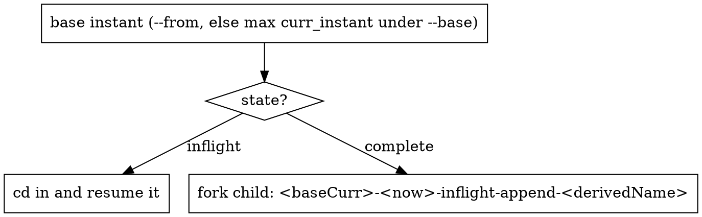

# Maintaining Effort Workspaces

## Overview

A long-running effort (one issue worked across many sessions) accumulates progress, surprises, decisions, and "how to run it" knowledge. If that state lives only in a session transcript, every resume, fork, or rewind loses it — and your human partner re-pastes the same status, PR links, scope, and build commands over and over.

Efforts also **branch**: a base capability is forked into several parallel features, each proven independently, then folded back together. Without names for those snapshots, "which one am I resuming?" and "what did this fork start from?" get re-elicited too.

**Core principle:** the workspace folder — not the conversation — is the interface between sessions. Model each snapshot as an **instant** (a named subfolder) laid out with fixed file names, so a cold session pointed at it knows the starting point, current state, what's left, and how to resume.

**Acceptance test:** point a fresh session at an instant folder → it reaches the next productive action without asking you for status, scope, PR links, or repro commands.

## When to Use

- Work on one issue/feature is **spanning multiple sessions** (or you expect it to).
- You run **concurrent/forked sessions**, spin up **parallel features** off a shared base, or get **rewound**, and state gets lost.
- Your partner keeps re-asking or re-pasting: "status?", "PR links?", "what's the scope again?", the build command, "is it actually green?".
- You're invoked via **`/maintain-workspace new|compact`** (see the command section).

**Not for** single-session tasks or anything that finishes before you stop. `HANDOFF.md` + `CHARTER.md` is the floor; the rest scales with the effort.

## The Instant Model

An **instant** is one effort snapshot: a self-contained subfolder under the base dir your partner points at. Its name encodes lineage and lifecycle so any session knows what it is at a glance. This is the Hudi-timeline metaphor applied to workspaces — a state change is a folder **rename**.

**Grammar (fixed, five fields):**

```
<base_instant>-<curr_instant>-<state>-<opType>-<instantName>
```

| Field | Values | Meaning |
|-------|--------|---------|
| `base_instant` | `main` or a parent's `curr_instant` | fork point — a **timestamp only**, never a full folder name, so it survives renames |
| `curr_instant` | `MMDDHHMM` | when this instant was created (e.g. `07181613`) |
| `state` | `inflight` · `complete` · `abort` | lifecycle; changing it means **renaming the folder** |
| `opType` | `append` · `compact` | `append` = created by the `new` op; `compact` = a fold-together |
| `instantName` | meaningful code | `toyExample`, `addfeature1`, `m1` |

**Layout — the base dir holds instants; each instant holds the canonical files:**

```
<base-dir>/                                       ← the mandatory --base folder you point me at
  main-07181613-complete-append-toyExample/       ← an instant (see Canonical Layout below)
  07181613-07191011-inflight-append-addfeature1/  ← forked off toyExample's curr_instant
  07181613-07191013-inflight-append-addfeature2/
  main-07191323-complete-compact-m1/              ← three features folded together, rebased on main
```

**Lifecycle:** an instant is born `inflight`; when its acceptance criteria are met you **`mv` it** to `…-complete-…` (or `…-abort-…` if dropped). Children point at the parent's `curr_instant`, not its folder name, so the rename never breaks a reference. `abort` instants are kept as history, never swept.

## The `/maintain-workspace` Command

Invocation: `/maintain-workspace <op> --base <base-folder-path> [--from <base-instant>] [--instants <a,b,c>]`, `op ∈ {new, compact}`. Args are key-value except the leading `op`. The command loads this skill; follow the matching flow.

**`--base <base-folder-path>` is always mandatory** — it is the folder that holds the instants (where they are created and found). If it is not supplied, **stop and elicit it in chat**; never silently default to the current working directory.

**`new`** — resume the effort or fork a new instant. `--from <base-instant>` is the optional **base to build on** (an existing instant, never a name); the new instant's name is derived from its purpose. The base defaults to the latest instant under `--base`, or is the one you name via `--from`:



- **Parallel siblings** fork off a *shared* base, so name that base via `--from`: three features off a completed `toyExample` are all `07181613-…-append-featureN`, not chained onto each other. With no `--from`, `new` forks off the single latest instant — which chains, not branches.
- Forking = create the child folder under `--base`, bootstrap its canonical files from templates, and carry forward `Setup to begin with` from the base's `STATE`/end state. `base_instant` = the base's `curr_instant` (a timestamp — survives the base's later renames).

**`compact`** — fold instants into one. `--instants <instantA,instantB,…>` is **mandatory** (elicit it in chat if absent). Create `main-<now>-inflight-compact-<name>/` under `--base` (**born `inflight`** — renamed to `…-complete-compact-…` once every merged AC is proven on the stack), write `COMPACTED.md` (Compaction section below + full recipe in `compaction.md`), and consolidate CHARTER/STATE/RUNBOOK/evidence. Inputs should be `complete`; an `inflight` input may be folded but its unmet ACs merge in as open. **Consumed instants stay on disk untouched.**

## The Four Invariants (hold *within* every instant)

1. **One entry point, fixed name.** Every instant has a `HANDOFF.md` at its root — *the* first file a resuming session reads. Everything else hangs off it via links.
2. **Durable vs. live, never mixed.** A doc is DURABLE (rarely changes; no CI run-ids, no "in progress") or LIVE (a dated snapshot understood to rot). Volatile state lives **only** in `HANDOFF.md`'s snapshot or `STATE.md`'s CI column — never in durable docs.
3. **One fact, one home — and the PR stack is mandatory.** The **`STATE.md` PR / branch-stack table is REQUIRED** — it exists even for a single PR, is the one home for the stack, and `HANDOFF.md` carries a one-line PR-stack summary that *links* to it (never a second copy — copies drift). In that table every **PR** cell is a full-URL link `[#N](…/pull/N)` and every **CI** cell is the PR's **checks page** `[#N checks](…/pull/N/checks)` (so a CI run is always reachable *from its PR*) plus the dated conclusion; a bare `#N` or bare run-id is INCOMPLETE.
4. **Evidence is captured into the folder, indexed, and reproducible — never `/tmp`.** A claim of "green" cites a file in `evidence/`, referenced by relative path (`/tmp` is gone on resume). Every artifact records its **provenance** (the job-id / command / commit that produced it), and `evidence/INDEX.md` maps each acceptance criterion → artifact → source → how to regenerate. An unlabeled pile of logs is nearly as useless as no logs.

Plus two register rules: **registers append, never rewrite** (decisions/issues/assumptions accrete with stable IDs + dates), and **the charter is sacred** (goal/scope/acceptance/constraints/raw-prompts written once, edited deliberately, so your partner never re-pastes them).

## Canonical Layout (fixed names inside each instant)

```
<instant>/
  HANDOFF.md      ← ENTRY POINT + "setup you end up with". resume cmd + session log + live snapshot + delivered PR stack + pointers to the scripts (→RUNBOOK) + where each AC's proof lives (→evidence/INDEX) + index. Points, never duplicates.
  CHARTER.md      ← DURABLE. Setup-to-begin-with · first-3-raw-prompts · acceptance(NL→proof→self-review) · Setup-to-end-up-with (the up-front PROMISE) · rules · env
  STATE.md        ← what-code-where + HOW each artifact was built & tested. dev steps noted as you go, distilled into a reviewer guide (artifact → built-by → provenance/CI-run → tested-by → which version used where) + repo→branch→githash→PR(full URL)→CI table
  RUNBOOK.md      ← runnable commands ONLY (build / run / repro / prove-it-ran; modes matrix if >1 mode). NO reviewer narrative — HANDOFF/STATE link here for the commands.
  DECISIONS.md    ← DURABLE. dated decision log + rationale (D-1, D-2, …)
  ISSUES.md       ← DURABLE. append-only register; ONE SUB-SECTION PER ISSUE (Symptom/Root cause/Action taken/Status) — not a table
  ASSUMPTIONS.md  ← DURABLE. unverified beliefs: OPEN/VERIFIED/REFUTED/SANCTIONED/DEFERRED
  COMPACTED.md    ← compact instants ONLY. included instants · one stacked PR chain · merged acceptance (all MET) · evidence disposition (regen | carried+why) · lingering-issue reconciliation (open|addressed|transformed) · compacted Setup-to-end-up-with (see compaction.md)
  investigations/ ← one subfolder per deep dive: <topic>/{analysis,validation,callstack}.md
  evidence/       ← captured proof (NOT /tmp). evidence/INDEX.md maps criterion→artifact→source→regenerate
  plans/ specs/   ← superpowers plan & spec docs (existing convention)
```

No new top-level doc per concern — resist it. **"how each artifact was built & tested (the reviewer narrative)" is STATE**; "commands to run" is RUNBOOK; "what's proven, by what" is `evidence/INDEX.md`; "the delivered handoff / where to find things" is HANDOFF. A `CAPABILITIES.md`/`MODES.md`/`STATUS.md`/`BUILD.md` almost always overlaps one of those — fold it in (invariant 3). Note the RUNBOOK↔STATE split: the *reviewer narrative* of how the deliverable was built (which image/jar, provenance, the multi-step chain, which version ran where) lives in **STATE** and accretes as you develop; RUNBOOK holds only the copy-paste commands and links back. Putting the build narrative in RUNBOOK is the common mistake.

Small efforts may fold `STATE`+`RUNBOOK` into `HANDOFF` and `ASSUMPTIONS` into `ISSUES` — but **always keep `HANDOFF.md` and `CHARTER.md`**. Never invent a new name for an existing role.

**File templates for every canonical file:** see `templates.md` in this skill directory. Copy them when bootstrapping an instant.

## The Charter Captures the Instant Lifecycle

The charter is the anti-re-paste card. It is organized as the instant's lifecycle so a cold reader sees where the work starts, what "done" means, and what it hands off:

- **Setup to begin with** — the starting state: `Empty`, or the branch set / base instant this one forks from (mirrors `base_instant` in the name).
- **First 3 raw prompts** — the session's first three prompts, **verbatim**, in their own section. This preserves the partner's original framing that scope/acceptance were distilled from.
- **Acceptance criteria** — each one is **NL statement → executable proof → self-review**:
  - Start in natural language.
  - Translate into something the **code itself executes** to decide pass/fail: a green test run, a script that greps for a beacon runtime log, a GitHub CI run. Not "I believe it works" — the run says so.
  - **Brainstorm to clarify** criteria that are vague, using superpowers:brainstorming.
  - Keep a running **self-review**: does the evidence captured so far actually fulfill this criterion? Update it as you go, not at the end.
- **Setup to end up with** — the handoff: deliverables (PRs, test-run links showing the beacon log, images, jars + where to find them, investigation summary, RCA doc) **and** a reproducible stack (PR stack, build scripts, scripts exercising the requirements, artifacts + their location) runnable with **trivial effort — run a few commands and grep, at most**.

## Maintenance Discipline

- **End every session by updating `HANDOFF.md`** — treat it like a commit, the last action before stopping: refresh the one-paragraph "where we are", the next action, the live snapshot, the "Resume here" header, AND **append a row to the session log** (`date | workspace | resume cmd | did what`). A single "Resume:" line loses every session but the latest; the log keeps each one re-attachable.
- **Transition state by renaming the instant.** When acceptance is met, `mv …-inflight-… …-complete-…` (or `…-abort-…` if dropped). Do it as part of the end-of-session update. The rename is the state transition — don't leave a finished instant labeled `inflight`.
- **Record both the workspace folder AND the session uuid.** `claude --resume <uuid>` attaches the conversation but does **not** restore the working directory — without the `cd`, a resumed session operates on the wrong tree. (The uuid is the transcript filename under `~/.claude/projects/…`.)
- **Write the fact to its home, then link.** New PR → a row in the `STATE.md` PR/branch-stack table (REQUIRED, even for one PR), referenced from `HANDOFF.md` by link. Never paste the table twice. **Record every external reference as a full-URL markdown link, never a bare id** — PRs (`[#360](…/pull/360)`), issues, tickets, commits. **Record a CI run *through its PR*:** the CI cell is the PR's checks page `[#N checks](…/pull/N/checks)` (optionally plus the specific `[run <id>](…/actions/runs/<id>)`), so every run is reachable from its PR — not a standalone run URL alone, and never a bare run-id. The stack spans multiple repos, so a bare number is ambiguous *and* not clickable on resume.
- **A surprise → a sub-section in `ISSUES.md` (or a row in `ASSUMPTIONS.md`) the moment it's spotted**, with a status — even "OPEN, unchecked". Issues are prose, one sub-section each: Symptom / Root cause (link an RCA doc if deep) / Action taken / Status.
- **A decision → a dated `DECISIONS.md` row** with rationale, the moment it's made.
- **A proof → an `evidence/` artifact + an `evidence/INDEX.md` row**, captured the moment you assert it. The row names the criterion, the artifact, the source (job/command/commit — as a clickable link), and the one-liner to regenerate. Don't let "it's green" live only in the transcript.
- **Durable docs carry no volatile state.** A CI run-id belongs in `HANDOFF`'s snapshot or `STATE`'s CI column — never in `CHARTER`/`DECISIONS`/`ISSUES`.
- **Header every doc:** `Updated: <date> by <uuid> | Status: DURABLE | LIVE`.

## Compaction

When several instants become one deliverable, `compact` folds them into `main-<now>-inflight-compact-<name>/` — **born `inflight`**, renamed to `…-complete-compact-…` only once every merged AC is proven on the stack. Compaction **stacks existing work — it is not new feature dev**: you fork the inputs' PRs into a single chain and re-prove them together, you do not build new behavior. It MUST satisfy a **four-part contract**, recorded in `COMPACTED.md` so the fold is auditable:

1. **One stacked PR chain (per repo).** For inputs whose PRs live in the **same repo**, fork and restack them on top of each other into a **single chain** (`base → feature1 → feature2 → …`) — one reviewable stack, not N parallel branches. The compacted `STATE.md` PR table reflects that chain; note the restack base and any rebase fix-ups.
2. **Every merged acceptance criterion is MET.** The compact owns the **union** of the inputs' ACs, and each must be *proven on the compacted stack*, not merely listed. A criterion with no passing proof on the new stack blocks the compact.
3. **Evidence is regenerated or carried-over-with-justification.** For each merged criterion, either **regenerate** its evidence on the compacted stack (per invariant 4) or **carry the original artifact over WITH an explicit justification** that it still holds on the new stack (byte-identical PR, or a static code-independent RCA). A rebase fix-up or a cross-repo/native rebuild (cache-MISS) voids byte-identical carry-over — runtime proofs must be regenerated. Silent reuse of stale evidence is not allowed.
4. **Every lingering issue / follow-up is reconciled.** Inputs marked `complete` may carry open concerns in their `ISSUES.md` / `HANDOFF.md`. Examine **all** of them against the new stack; each resolves to exactly one of: **remains-open** (still open — we only stacked PRs, no new dev), **addressed** (closed by another input's PR, or trivial and handled inline), or **transformed** (partly addressed / became a different follow-up, with what remains). Nothing is dropped silently; `remains-open` and `transformed` items also become live sub-sections in the compact's `ISSUES.md`.

The compacted **`RUNBOOK.md` stays self-contained** — one build + one validation run re-derives ALL evidence for the merged criteria. Consumed instants remain on disk as history. **Full recipe + the required `COMPACTED.md` slots: see `compaction.md` in this skill directory.**

## When the Deliverable Is a Validated Capability (not just a fix)

When the effort **hands off a working, validated thing** (a tool, a pipeline, a reproducible benchmark), add three habits so a cold reader can re-prove it — in the existing docs, not a new one:

- **A modes matrix in `RUNBOOK.md`.** More than one mode/config → a small table: each mode → exact command → the **proving run** (job-id + run dir) → the evidence it produced. Still "how to run it", just multi-mode.
- **Provenance on every artifact.** A raw log with no "came from job X via command Y at commit Z" is a dead-end. Put it in the artifact header or the `evidence/INDEX.md` row.
- **Prefer a runnable re-derivation over a screenshot.** The strongest proof is a committed script that re-checks the claim in one command (`validate_<x>.sh <logdir>` → PASS), not a pasted log a reader must eyeball.

## The Resume Contract (what a cold session does in ~60s)

1. **Identify the instant** — from the base dir, pick the target instant (latest `inflight`, or the one your partner named). Read its name: base/state/opType tell you lineage and whether it's live.
2. Read `HANDOFF.md` → workspace folder + resume command(s), session log, where-we-are, next action, index.
3. Read `CHARTER.md` → stay in scope; the acceptance criteria (with proofs + self-review) and raw prompts are here — don't re-ask.
4. Skim `STATE.md` → know the working set; don't re-elicit branches/PRs.
5. Open `RUNBOOK.md` → rebuild, rerun validation, invoke each mode without re-pasting commands.
6. Glance `ASSUMPTIONS.md` + `ISSUES.md` → know open risks and what's deferred (don't re-propose a REFUTED approach).
7. Check `evidence/INDEX.md` → know which claims are proven, by which artifact, how to re-derive.
8. Only then dive into `investigations/` for the specific task.

If those files can't carry a fresh session from cold to productive, the layout failed.

## The Reviewer Contract (what a cold REVIEWER checks — companion to the Resume Contract)

A reviewer asks different questions than a resumer: not "where do I continue?" but **"what was delivered, how was it built, how is it proven, and how do I re-run it?"** Answer them in this order:

1. `HANDOFF.md` → the **delivered handoff**: the PR stack, links to the scripts (→ RUNBOOK), and where each acceptance criterion's proof lives (→ `evidence/INDEX.md`).
2. `STATE.md` → **HOW each artifact was built & tested** — the reviewer guide distilled from the build/test steps you noted *as you developed* (artifact → built-by → provenance / CI-run → tested-by → which version was used in which test). Multi-step build chains (CI job → published artifact → local assembly → run) belong here, narrated once, end-to-end.
3. `evidence/INDEX.md` → the **proofs** (criterion → artifact → source → regenerate).
4. `RUNBOOK.md` → **re-run the commands** yourself.

If a reviewer can't answer *delivered / how-built / how-proven / how-to-rerun* from those four in order — without spelunking scattered notes — the layout failed. The build-&-test narrative is the piece most often misfiled: it goes in **STATE** (accreted + distilled), never in RUNBOOK.

## Common Mistakes

| Mistake | Fix |
|---------|-----|
| Ad-hoc folder names (`v2`, `retry`, `final`) | Use the instant grammar: `<base>-<curr>-<state>-<opType>-<name>`. |
| Finished work still labeled `…-inflight-…` | `mv` to `…-complete-…` at session end — the rename IS the transition. |
| A fork's name loses where it came from | `base_instant` = parent's `curr_instant`; children point at the timestamp, not the folder name. |
| Three docs each claiming to be "the" status | One `HANDOFF.md`. Others link to it. |
| CI run-ids / "watcher …" in `CHARTER`/`DECISIONS` | Quarantine volatile state to `HANDOFF` snapshot or `STATE`. |
| PR / CI-run / issue recorded as a bare id (`#123`, `run 4711`) | Full URL as a markdown link — clickable on resume, unambiguous across a multi-repo stack. |
| No PR/branch-stack table in `STATE.md` (or only in HANDOFF prose) | The `STATE.md` table is REQUIRED even for one PR; HANDOFF's PR-stack line links to it. |
| CI recorded as a standalone run-id, not reachable from its PR | CI cell = the PR checks page `[#N checks](…/pull/N/checks)` + dated conclusion (+ optional run link). |
| Acceptance criterion is an opinion ("looks done") | It must be a run the code executes: green test / grep beacon log / CI run. |
| Charter distilled scope but dropped the partner's words | Keep the **first 3 raw prompts** verbatim in CHARTER. |
| Issues crammed into a table | One sub-section per issue: Symptom / Root cause / Action taken / Status. |
| Proof logs in `/tmp` | `evidence/<date>-<name>.log`, referenced by relative path. |
| Compact instant with no record of what it folded | `COMPACTED.md`: included instants · one stacked PR chain · union acceptance (all MET) · evidence disposition · lingering-issue reconciliation. See compaction.md. |
| Compact leaves inputs' PRs as N parallel branches | Fork & restack same-repo PRs into ONE chain (`base → f1 → f2 → …`); STATE table reflects the chain. |
| Merged AC marked done because an input once proved it | Re-prove each merged AC **on the compacted stack** — an input's isolated proof doesn't cover the restack. |
| Input evidence reused with no note | Regenerate on the stack, OR carry over with an explicit justification (why it still holds) in the disposition table. |
| An input's open issue / follow-up vanishes in the compact | Reconcile EVERY concern to remains-open · addressed · transformed; carry open/transformed ones into the compact's ISSUES.md. |
| Recording resume uuid but not the workspace folder | Record both — uuid alone resumes onto the wrong tree. |
| `evidence/` is an unlabeled pile of logs | `evidence/INDEX.md`: criterion → artifact → source → regenerate. |
| Spinning up `CAPABILITIES.md`/`MODES.md`/`STATUS.md` | Fold into RUNBOOK / `evidence/INDEX.md` / STATE. One fact, one home. |
| How-the-deliverable-was-built narrative written in RUNBOOK (or scattered across INDEX/HANDOFF) | Narrative → **STATE** (noted as you dev, distilled into a reviewer guide); RUNBOOK = commands only; HANDOFF + `evidence/INDEX.md` link to it. See the Reviewer Contract. |
