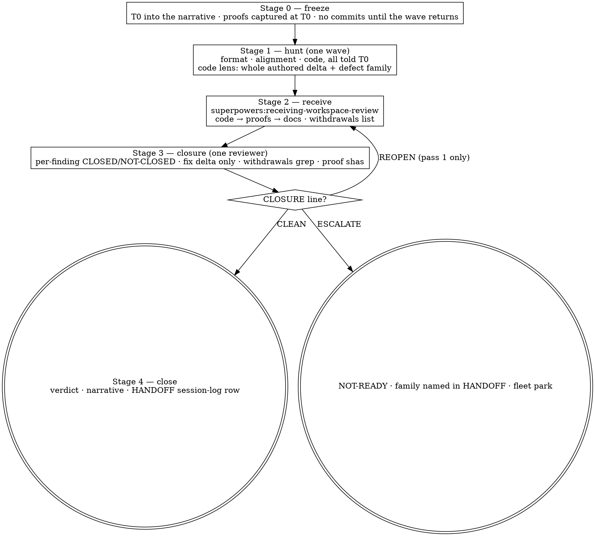

# Reviewing Effort Workspaces

## Overview

Fresh-eyes review of a `superpowers:maintain-workspace` **instant**: is it well-formed, does its
evidence prove its charter, is the delivered code sound. Three read-only reviewer subagents look
once, together, at a frozen tip; the findings are received through
`superpowers:receiving-workspace-review`; one closure reviewer verifies the pass and reviews only
what it changed; a stop rule ends the loop.

**Core principle:** hunt once, receive with discipline, close by rule. Measured on six instants,
the review that ran its three lenses in one wave on a frozen tree converged in one pass; the ones
that fixed between lenses and re-reviewed each fix ran 6, 9, 10 and 17 rounds, each round finding
what the previous round's fixes had introduced.

The orchestrator (you) is the only writer. Reviewers report; nothing they say is applied in line.
Every finding goes through `fleet review --finding`; `REVIEW.md` is the generated view of that ledger
and `REVIEW-NARRATIVE.md` (template in `templates/`) is where the reasoning, the kind of each round
and the receive triage tables live.

## When to Use

- Before `fleet complete` — the pre-complete hunt. Run it **before** proposing done, while the last
  CI wave is in flight, so a finding costs at most one wave.
- Mid-effort, to catch deviation early. That is a separate review with its own `T0`.
- After a receive pass — the closure round (`/review-workspace --closure`).

**Not for** a task with no instant. One instant per run.

## The pipeline

**Stage 0 — freeze.** Identify the instant. Read `HANDOFF.md` and `CHARTER.md`. Write `T0` (the
repo sha, never a branch name) into `REVIEW-NARRATIVE.md`. Every runtime proof must already be
captured at `T0` on a clean worktree; if not, that is the worker's last commit-free action before
the wave. Nothing is committed until the wave returns.

**Stage 1 — hunt.** Dispatch three read-only reviewers in one wave (three is the charters' fan-out
cap), each with `[REVIEW_TIP]` = `T0`:
- `reviewers/format-reviewer.md` — paste the maintain-workspace Four Invariants + register rules +
  Common Mistakes + Canonical Layout into `[MAINTAIN_WORKSPACE_INVARIANTS]`; never restate them here.
- `reviewers/alignment-reviewer.md` — per acceptance criterion `VERIFIED | INSUFFICIENT | MISALIGNED`,
  register cross-check, open review questions, new issues to track.
- `skills/requesting-code-review/code-reviewer.md` per in-scope PR, filled per `reviewers/README.md`:
  base = merge-base, head = `T0`, description carrying the **defect family**.

Record every finding through `fleet review`, one call per reviewer at `T0`, each carrying that
lens's own `--scope` (`format`, `alignment`, `code`) — safer than one 30-finding call, because a
session that dies mid-wave loses one reviewer's findings rather than three, and the gate reads scope
coverage as the union across rounds, so the three calls together cover `all` while a one-lens hunt
stays honestly partial. Each call carries a `--verdict`: that is what writes the round, and
`--finding` values handed over without one are recorded nowhere. **The verdict is read off that
round's own findings** — an `open` Critical or Important in it makes it `NOT-READY`; only Minor/Nit
open makes it `READY-WITH-FIXES`; none open makes it `READY`. A finding against a file this instant
does not own is `routed` with the owner in its action; that is the only use of `routed`. Open review
questions go to your human partner, recorded as findings, never silently resolved. The alignment
lens's register deviations and new issues to track are recorded as findings too, and reach
`ISSUES.md` through the receive pass's `Noticed along the way` route — nothing is fixed here.

**Stage 2 — receive.** `superpowers:receiving-workspace-review`, pass *n* (pass 1 receives the hunt;
a `REOPEN` re-enters as pass 2). Its triage table goes in the narrative under `Receive pass <n>`, one
row per finding, and every row's `closed by` cell names a sha, a path, `sweep — N sites`, an owner
or a reason — a cell still reading `TBD` is an unrecorded finding. Its `Noticed along the way` list
is written before anything is recorded, and each line of it lands in `ISSUES.md` or as a `routed`
finding. Claim fixes leave `evidence/review/withdrawals-pass<n>.txt` behind for the closure reviewer
to grep. The pass ends with `fleet review --finding` per finding, written from the tree.

**Stage 3 — closure.** Dispatch `reviewers/closure-reviewer.md` with `[INSTANT_PATH]`,
`[REPO_PATHS]`, `[T_PREV]` (the tip the findings were raised against), `[T_NOW]`, `[PASS_NUMBER]`,
`[WITHDRAWALS_PATH]` and `[DEFECT_FAMILY]`. It returns a verdict per finding, the fix-introduced
defects it found in `[T_PREV]..[T_NOW]`, the withdrawal values that still have hits, a proof-sha
table, anything it noticed outside the delta, and one `CLOSURE:` line. Record it:
- `CLOSED — <what was checked>` → restate the finding `applied`.
- `NOT-CLOSED — <what is still wrong>` → restate it `open`. A withdrawal hit and a proof sha that
  is not `[T_NOW]` come back as `NOT-CLOSED` against the finding that owns them.
- `REGRESSED — <new id>` → restate it `open` with that text; the regression itself is the
  fix-introduced item recorded below under that id.
- `NOT MINE` → not restated at all. It keeps its `routed` or `wont-fix` status and its owner.
- Every FIX-INTRODUCED and OUTSIDE THE DELTA item → a new `open` finding under the id the reviewer
  gave it. `open`, not `routed`: a defect found during closure blocks the gate like any other, and
  the stop rule decides what happens to it. Prefix fix-introduced text with `fix-introduced — ` (an
  em dash; a colon in a finding's text is split by the verb).

The closure round is one `fleet review` call carrying every restatement and every new finding, under
the scope(s) the hunt actually covered — `--scope all` only when all three lenses ran; otherwise the
lens scope(s) of the findings it restates, one call per scope. A closure recorded `all` after a
one-lens hunt is the ledger telling the gate that two lenses ran which never did. Its `--verdict` is
read off the ledger by the same rule as a hunt's — `NOT-READY` while an `open` Critical/Important
stands, `READY-WITH-FIXES` with only Minor/Nit open, `READY` with none.

**Stop rule** (counted in receive passes, which you perform and number):
1. `CLOSURE: CLEAN` → verdict `READY` (`READY-WITH-FIXES` if only Minor/Nit remain). Stage 4.
2. `REOPEN` after pass 1 → pass 2, then closure 2.
3. `ESCALATE` — any Critical/Important item still standing after pass 2 (a NOT-CLOSED, a REGRESSED,
   a fix-introduced, or an OUTSIDE item), or an OUTSIDE item that needs new deliverable work at any
   pass → record the round `NOT-READY`, name the defect family in HANDOFF next-actions, `fleet park`
   with the question. No third receive pass on your own authority.
4. Never a second hunt against the same review. A human partner may ask for one; the narrative
   records who asked.

**Stage 4 — close.** Round summary in the narrative; a HANDOFF session-log row pointing at the round.
The instant is not renamed here.

## What blocks, exactly

`fleet complete` runs the review gate: a newest round `NOT-READY`, or any `open` Critical/Important,
refuses the rename. <!-- v2-cite: open-blocking-finding-refuses-ready I2 -->
It also refuses until `format`, `alignment` and `code` have all been covered across the ledger's
rounds, so a hunt that ran one lens cannot complete until the other two have run — and the harvest
that waits on the rename inherits that. <!-- v2-cite: scope-coverage-is-the-union I4 -->
`fleet propose --status done` refuses a head no round has seen. `routed`,
`wont-fix`, Minor and Nit never block. `fleet review` prints advisories, which block nothing; two of
them are about this loop. `OSCILLATING` — three or more consecutive head-moving epochs (a round joins
the current epoch while the heads do not move) each raising a Critical/Important finding first seen
in that epoch, `CV-` coordinator ids excluded; the slot HEAD is a proxy for the reviewed tip, so read
the narrative before acting. `RECEIVE` — a round that records blocking findings names the receive
skill. A clean lens round records a verdict with no findings and the verb prints `THIN LEDGER` for
it; under per-lens rounds that is expected, and never a reason to invent a finding.

## Ledger discipline

The ledger is `.fleet/review.json`, written only by `fleet review --finding`. `REVIEW.md` is the view
it regenerates in full — two workers wrote their narrative there and lost it. Findings get stable ids
`RV-1, RV-2, …`; a later round restates an id to change its status and never edits history. `applied`
names what closed it — a commit sha, an artifact path, `sweep — N sites` — or the closure reviewer
records it `NOT-CLOSED`. No colon inside a finding's text: locations are written `file line N`.

## Quick reference

| stage | dispatch | returns | you record |
|---|---|---|---|
| 1 hunt | format · alignment · code, one wave at `T0` | findings; per-AC verdicts; per-PR verdicts | every finding, one call per reviewer under that lens's `--scope` |
| 2 receive | `superpowers:receiving-workspace-review` | triage table, commits, refreshed proofs, withdrawals | `applied`/`routed`/`wont-fix` from the tree |
| 3 closure | `reviewers/closure-reviewer.md` | per-finding verdicts, fix-introduced, withdrawal hits, proof shas, `CLOSURE:` line | restatements; new items `open`; the stop rule |
| 4 close | — | — | verdict, narrative, HANDOFF row |

## Common mistakes

| Mistake | Fix |
|---|---|
| Reviewing a branch name | Reviewers get a sha. A branch moved under a reviewer is a stale review nobody can tell from a fresh one. |
| A reviewer that fixes what it finds | Reviewers are read-only. An in-line header fix once destroyed an mtime proof for a different AC. |
| Fixing between lenses, then re-reviewing the fix | One wave at `T0`; one receive pass; one closure. Fixes between lenses moved the tip under every next lens. |
| Code lens diffed since the last round | Whole authored delta, every hunt, with the defect family named. |
| A closure round that "also had a look around" | Record what it noticed `open`, then the stop rule. It does not hunt. |
| `routed` for a finding in a file this instant owns | `routed` means "not mine to edit". Everything else is `open`, `applied` or `wont-fix` with a reason. A closure `NOT MINE` row is the reviewer reading that status back, not a new one. |
| Closure recorded `--scope all` after a partial hunt | The closure's scope is the hunt's coverage; `all` after one lens tells the gate two lenses ran that did not. |
| A second hunt because closure found things | Stop rule 3: park it. The operator opens hunts. |
| Findings only in the transcript | Everything through `fleet review --finding`; reasoning in `REVIEW-NARRATIVE.md`. |
| Marking an AC VERIFIED on a prose or stale proof | Proof at `T0` (hunt) or `T_now` (closure), or `INSUFFICIENT`. |

## Related skills

- **REQUIRED CONTEXT:** `superpowers:maintain-workspace` — the instant and its invariants.
- **REQUIRED SUB-SKILL (Stage 2):** `superpowers:receiving-workspace-review`.
- **REUSED (Stage 1):** `superpowers:requesting-code-review` — `code-reviewer.md` per PR.
- **INTEGRATED:** `superpowers:verification-before-completion` — a VERIFIED verdict rests on a proof at the tip.
