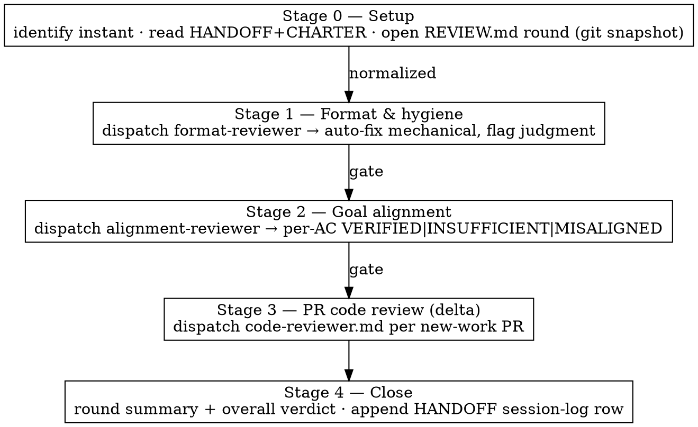

# Reviewing Effort Workspaces

## Overview

A fresh-eyes reviewer for a `superpowers:maintain-workspace` **instant** — the workspace analogue of `superpowers:requesting-code-review`. A resuming session asks "where do I continue?"; a reviewer asks **"is this workspace well-formed, does its evidence actually prove the charter, and is the delivered code sound?"**

**Core principle:** review three lenses **cheapest-and-most-foundational first**, gated in sequence — you cannot trust a content review of a malformed workspace, and code-reviewing PRs is premature before you know what the charter required. Each stage dispatches a **read-only** reviewer subagent (fresh context — no session history, the whole point of review). The orchestrator (you) is the only writer, and every finding lands in an append-only `REVIEW.md` ledger.

**Advisory, always.** This skill recommends; the operator decides. It never blocks a completion and never renames an instant.

## When to Use

- You're about to `mv …-inflight-… …-complete-…` and want the instant checked first (the advisory pre-complete gate).
- **Mid-effort**, to catch deviation from the charter early — before more work compounds on a wrong approach.
- Your partner asks "is this workspace ready?", "did we actually prove the goal?", "audit this instant".

**Not for:** a single-session task with no maintain-workspace instant (there's nothing to review). Review one instant per run.

## The Pipeline

**Stage 0 — Setup.** From `--base`/`--instant`, identify the instant (default: the latest `…-inflight-…`). Read `HANDOFF.md` + `CHARTER.md`. If `REVIEW.md` is absent, bootstrap it from `templates/REVIEW.md`. Open a new round `R<n>`: date, trigger (`on-demand`/`pre-complete`), scope, and a git-SHA snapshot of each repo in the HANDOFF PR-stack table.

**Stage 1 — Format & hygiene.** Dispatch a read-only subagent using `reviewers/format-reviewer.md` — **paste the maintain-workspace Four Invariants + register rules + Common Mistakes + Canonical Layout into its `[MAINTAIN_WORKSPACE_INVARIANTS]` placeholder** so the checklist has ONE source of truth (never restate the invariants here). It returns findings tagged `mechanical | judgment`. You then:
- **auto-fix every `mechanical` finding in place** (fold a stray `STATE.md` into HANDOFF; bare `#123` → full-URL link; add a missing `evidence/INDEX.md` row; quarantine a run-id out of a durable doc) → record each as `Status: ADDRESSED (auto-fix)` with a before/after note.
- **flag every `judgment` finding** (missing evidence, contradictory decisions) → `Status: OPEN`.
- Gate: stage 2 runs on the now-normalized workspace.

**Stage 2 — Goal alignment.** Dispatch a read-only subagent using `reviewers/alignment-reviewer.md`. It builds the chain `setup-to-begin → deliverable → evidence → acceptance → goal` and returns, per acceptance criterion, exactly one verdict: `VERIFIED` (artifact present, sufficient, re-derivable), `INSUFFICIENT` (names what evidence must be supplemented), or `MISALIGNED` (approach violates a charter constraint/design philosophy). Record each; raised gaps become `RV-<n>` findings. Gate: proceed to stage 3 (a Critical misalignment may recommend deferring it).

**Stage 3 — PR code review (delta).** Reuse `superpowers:requesting-code-review` — see `reviewers/README.md` for PR selection (only PRs authored on THIS instant; inherited base PRs skipped) and the incremental rule (diff from the prev-reviewed head SHA recorded in `REVIEW.md`). Dispatch `skills/requesting-code-review/code-reviewer.md` verbatim per in-scope PR; merge its Strengths/Issues/Assessment into `REVIEW.md`; update the last-reviewed head SHA. No new-work PRs → record `N/A`.

**Stage 4 — Close.** Write the round summary + overall verdict, then append a HANDOFF session-log row pointing at the round. Do **not** rename the instant.

## REVIEW.md Discipline

`REVIEW.md` is a new canonical maintain-workspace file — an **append-only** register, same discipline as DECISIONS/ISSUES. Bootstrap it from `templates/REVIEW.md`.

- Findings get stable IDs `RV-1, RV-2, …`. Never rewrite a finding — **supersede in place**: update its `Status` with a dated note.
- A finding re-observed in a later round **references its prior `RV-id`**, so the ledger shows the whole arc from raised → addressed. This is the audit trail.
- **Overall verdict** per round:
  - `READY` — no OPEN Critical/Important; every AC `VERIFIED`; chain intact.
  - `READY-WITH-FIXES` — only Minor (and enumerated Important) open.
  - `NOT-READY` — an OPEN Critical, a broken chain, or an `INSUFFICIENT`/`MISALIGNED` AC.
- Completing an instant with an OPEN Critical is the operator's call, but **must be recorded in `REVIEW.md` as an explicit override**.

## Quick Reference

| Stage | Lens | Dispatch | Returns | Orchestrator action |
|-------|------|----------|---------|---------------------|
| 1 | Format & hygiene | `reviewers/format-reviewer.md` | findings `mechanical\|judgment` | auto-fix mechanical → ADDRESSED; flag judgment → OPEN |
| 2 | Goal alignment / evidence chain | `reviewers/alignment-reviewer.md` | per-AC `VERIFIED\|INSUFFICIENT\|MISALIGNED` | record verdicts; gaps → RV findings |
| 3 | PR code review (delta) | `requesting-code-review/code-reviewer.md` | Strengths / Issues / Assessment | merge into REVIEW.md; update last-reviewed SHA |
| 4 | Close | — | — | round summary + overall verdict; HANDOFF session-log row |

## Common Mistakes

| Mistake | Fix |
|---------|-----|
| Restating the maintain-workspace invariants in the format checklist | Paste the authoritative invariant text into the reviewer's `[MAINTAIN_WORKSPACE_INVARIANTS]` placeholder — one source of truth, no drift. |
| Auto-fixing a judgment call (e.g. inventing missing evidence) | Only `mechanical` findings are auto-fixed; judgment findings are flagged `OPEN` for the operator. |
| Blocking completion until findings are resolved | Advisory only — recommend a verdict, record it, never block or rename the instant. |
| Code-reviewing the full PR stack every round | Delta only — review PRs authored on this instant, diffed from the prev-reviewed head SHA. Skip inherited base PRs. |
| Findings left in the session transcript | Every finding + status + action-taken lives in `REVIEW.md` (append-only) so the audit trail survives the session. |
| Marking an AC VERIFIED on a prose assertion | Acceptance needs a proof the code executes (green test / grep beacon log / CI run); assertion-only → `INSUFFICIENT`. |

## Related Skills

- **REQUIRED CONTEXT:** `superpowers:maintain-workspace` — defines the instant, its canonical files, and the invariants this skill enforces.
- **REUSED in Stage 3:** `superpowers:requesting-code-review` — the `code-reviewer.md` template dispatched per PR.
