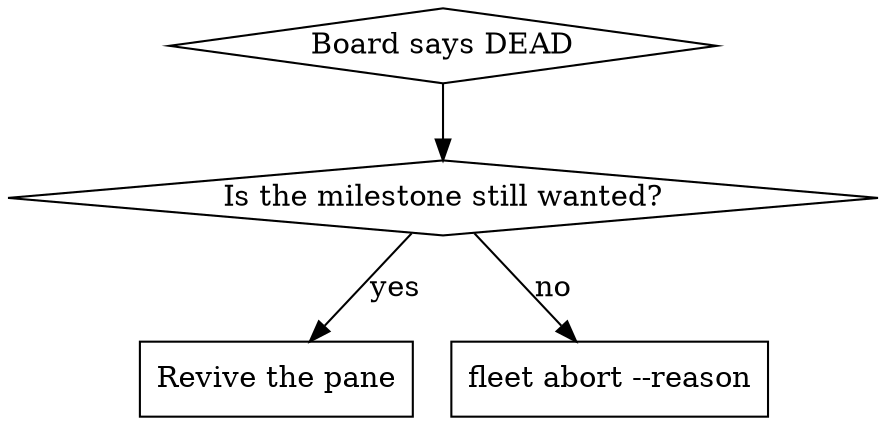

# Reviving Dead Panes

## Overview

A reboot takes the tmux **server** with it. Every dispatched worker's session is gone at once, every
lease is still held, and `fleet board` reads `DEAD` for each one:

> *launched at 2026-08-26T23:00:31Z and no session is alive on tmux server 'fleet-davis': the work
> stopped without renaming its folder*

**`DEAD` is a statement about the process, not about the work.** The instant folder, its `.fleet/` state,
its roadmap claim and the worker's own transcript all survive. Nothing is lost; a pane is missing.

**`DEAD` names the server it asked, and `UNREACHABLE` is a different state with a different remedy.**
`UNREACHABLE` means a live pid holds the slot but no session answered — the work is running and only its
pane is out of reach, so there is nothing to revive. Revive `DEAD`. For `UNREACHABLE`, read the server in
the note; `fleet` follows the record on its own, and the remaining reason to care is that raw `tmux -L`
commands do not.

Use `fleet revive --id <todo-id> --session-id <uuid>`. It retains the instant and lease, verifies the
exact transcript's workspace, and starts the recorded runtime with its recorded configuration.
`fleet resume` only adopts an existing instant; `fleet dispatch` creates a new one. Neither substitutes
for revival. A failed resume retains the lease and never silently starts a fresh session.

**Announce at start:** "I'm using the reviving-dead-panes skill to bring the worker's session back."

**REQUIRED BACKGROUND:** superpowers:using-fleet owns the verb surface, the `pane-guard` contract and the
guarded messaging rule this skill builds on.

## Decide first: revive, or abandon?



Read the instant's `HANDOFF.md` and its `.fleet/` before choosing. A worker that already recorded an
`abort.json` whose rename never completed is **not** a revival candidate — finish the abort instead;
re-running `fleet abort` over an already-recorded reason completes the rename, the pane close and the
lease release in one call.

## The procedure

`scripts/fleet-revive.sh` derives every value below from the record and writes the launcher. Use it, and
read this section to know what it is doing and why each value is where it is:

```bash
bash scripts/fleet-revive.sh plan        <todo-id>   # every derived value, before anything is created
bash scripts/fleet-revive.sh transcripts <todo-id>   # verified workspace candidates — see trap 1
bash scripts/fleet-revive.sh launcher    <todo-id> <transcript-id>
bash scripts/fleet-revive.sh start       <todo-id>
```

The direct form is:

```bash
fleet revive --id "$ID" --session-id "$SESSION_ID" --dry-run
fleet revive --id "$ID" --session-id "$SESSION_ID"
```

The runtime must match the fleet selection. The original lease must still be held, and both the pane
and workspace must be unoccupied. The launcher exports the record's socket, instant, store and resolved
configuration explicitly. Legacy records without executable/configuration metadata use the workspace
owner resolver and say so visibly. A failed configuration or transcript check does not guess a fallback.
The helper's generated launcher calls `fleet revive` at actual start, so the same locks and checks apply.

### 1. Revive by transcript id, not `--continue`

A slot is re-leased across efforts, so the newest transcript in the slot's project directory is not
reliably the worker you are reviving. One slot here held three, from three occupants weeks apart.

```bash
bash scripts/fleet-revive.sh transcripts <todo-id>    # runtime and workspace candidates, derived
```

Inspect the candidate transcript and choose the UUID belonging to this worker; mtime alone is not identity. Pass it to `--session-id` explicitly. The script lists and
refuses to choose, because that judgement is the only part of this step that is not mechanical.

### 2. A resumed session opens a MENU, and `pane-guard` reads that menu as unsubmitted text

`fleet revive` always passes the explicit session id, so this menu is reached only by a hand-typed
`--resume` with no id; it is kept because that is exactly what a rushed operator types.

Past a size threshold the TUI asks how to resume — *Resume from summary / Resume full session as-is /
Don't ask me again* — before it is ready for input. Measured on a 435k-token session: **twelve
consecutive `pane-guard` polls, five seconds apart, all returned `10 queued-text`** while the pane was
showing that menu. (Measured before the dialog rows landed; if the menu draws a hint row it may now read
`15 awaiting-operator` instead — either way it is not a human's draft, and the advice below stands.)

`10` there does **not** mean a human left something in the box. Two consequences:

- **Read the pane before you believe the code.** `10` is not evidence of a boot that finished.
- **Do not submit a menu as if it were a message draft.** `fleet send` requires an observed idle
  input before insertion and the exact message afterward. Inspect and resolve a real resume menu first.

### 3. `capture-pane -t "=$SESSION"` fails on a session that EXISTS

A pane target parses as `session:window.pane`, and `=name` alone is not a session part. Measured on tmux
3.2a against one live session:

| target | result |
|---|---|
| `dt-x2ansilinearstack` | rc 0 |
| `=dt-x2ansilinearstack` | rc 1 — **can't find pane** |
| `=dt-x2ansilinearstack:` | rc 0 |

`session.exact_pane_target` appends the colon for exactly this reason and guarded messaging inherits
it. An operator typing `capture-pane` by hand reaches for `=name`, gets *can't find pane*, and concludes
the revival failed when it did not.

**Use `FLEET_TMUX_SOCKET="$SOCKET" fleet_peek "$SESSION"`** — the helper in `scripts/fleet-env.sh` gets
the target right, but it reads the socket from the ENVIRONMENT, which is the shell's server and not
necessarily the record's. Measured: a shell carrying `FLEET_TMUX_SOCKET=fleet-davis` ran `fleet_peek`
against a worker whose record named another server and got *"error connecting to …/fleet-davis"*. Pass
the record's socket in front of it, every time; a bare `fleet_peek` is right only when the two happen to
agree, which is exactly the assumption this skill exists to break.

### 4. Revive on the server the RECORD names, or the board keeps looking at the old one

A record carries `tmux_socket`, and every verb resolves the session through it — so a pane revived on a
*different* server than the record names is invisible to `board`, `status`, `close` and `abort`, however
healthy it is. This is the one trap that did not exist before per-root isolation, and it is created by the
thing that fixed the others.

`fleet revive` uses the recorded server automatically. Do not manually start a second pane on another
server or re-point the record to hide a failed revival. Inspect `fleet status --id "$ID" --porcelain`.

## Never send a navigation key on spec

Capture the pane and confirm the menu is actually on screen before sending `Down`, `Up` or `Enter`. A
`Down` sent after the menu had already resolved landed in the input box instead and opened the
slash-command completer on **`/compact`** — one `Enter` away from compacting the very session being
revived. `Escape` clears it.

The general rule: a keystroke aimed at a widget that is not there does not vanish, it hits whatever is.

## Verify, and write nothing

Liveness is **derived**, so the board corrects itself once the process is up — no verb is needed and none
should be run:

```bash
fleet pane-guard --id "$ID"           # 0 = safe; --id resolves the pane on the record's OWN server
fleet board                           # DEAD → the declared phase, by itself
```

**Check with `--id`, not `--pane`.** A bare session name carries no address, so `--pane` asks whichever
server the shell points at and answers `13 unknown-pane` — *this pane does not exist* — about a pane that
is alive on another one. `--id` has the record and follows it.

Measured: a worker went `DEAD` → `AWAITING-CI` with no fleet command run against it. If you find yourself
reaching for `fleet resume` to "re-register" a revived pane, stop — the record never stopped being
correct. Check the board first.

## Common mistakes

| Mistake | Reality |
|---|---|
| `fleet resume` to bring a pane back | It adopts a record and starts no process. Use `fleet revive` to start the recorded session. |
| `fleet dispatch` to "re-run" the worker | Mints a NEW instant and lease; abandons the transcript. That is replacement. |
| Reading `DEAD` as "the work failed" | It means no session is alive. The folder, `.fleet/` and transcript are intact. |
| Bare `claude` in `new-session` | `sh -c` misses the shell function, so `CLAUDE_CONFIG_DIR` is wrong and `--resume` finds nothing. |
| `claude --continue` | Picks the newest transcript in the cwd, which may belong to a previous occupant of the slot. |
| Trusting `pane-guard 10` during boot | The resume menu reads as queued text. Capture the pane. |
| `capture-pane -t "=$SESSION"` | Not a pane target. Use `=$SESSION:`, or `fleet_peek`. |
| `SOCKET=fleet`, or any literal server | Every root has its own (`fleet-<name>`). Read `evidence.tmux_socket` from the record. |
| Taking the server from `fleet leases` | It has no socket column — `slot, lease, todo_id, owner, tmux, claimed_at, path`. Only `status --porcelain` carries it. |
| Reviving on a server the record does not name | Every verb resolves through the record. The pane runs and the board cannot see it. |
| `pane-guard --pane` to check a revived pane | Asks the ambient server and answers `13` about a live pane elsewhere. Use `--id`. |
| `FLEET_HOME=$HOME/.fleet` in the launcher | The pre-isolation path. Export `FLEET_ROOT` and let the marker supply the rest. |
| Sending `Down`/`Enter` blind | Lands in the input box if the menu is gone; `/compact` is one Enter away. |

## Related tools

- `scripts/fleet-revive.sh` — `plan` / `transcripts` / `launcher` / `start`. Every value derived from the
  record; it creates only the launcher and the session, and it never sends a key.
- `fleet_peek`, `fleet_attach` in `scripts/fleet-env.sh` — the pane target and the `-L` flag, correct.

## Related skills

- superpowers:using-fleet — the verb surface, `pane-guard` codes, and the guarded messaging contract.
- superpowers:coordinating-instants — you are the coordinator deciding revive-vs-abort.
- superpowers:working-as-a-dispatched-instant — you ARE the worker that just came back.
