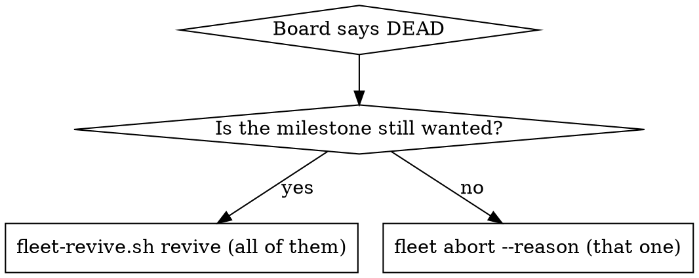

# Reviving Dead Panes

## Overview

A reboot takes the tmux **server** with it. Every dispatched worker's session is gone at once, every
lease is still held, and `fleet board` reads `DEAD` for each one:

> *launched at 2026-08-26T23:00:31Z and no session is alive on tmux server 'fleet-davis': the work
> stopped without renaming its folder*

**`DEAD` is a statement about the process, not about the work.** The instant folder, its `.fleet/` state,
its roadmap claim and the worker's own transcript all survive. Nothing is lost; a pane is missing.

**`DEAD` names the server it asked, and `UNREACHABLE` is a different state with a different remedy.**
`UNREACHABLE` means a live pid holds the slot but no session answered — the work is running and only its
pane is out of reach, so there is nothing to revive. Revive `DEAD`. For `UNREACHABLE`, read the server in
the note; `fleet` follows the record on its own, and the remaining reason to care is that raw `tmux -L`
commands do not.

**Everything mechanical is one script, and it takes no arguments.** `scripts/fleet-revive.sh` reads the
board of the fleet you are standing in, finds every `DEAD` record, derives every value from the records
(server, slot, configuration directory, transcript), refuses the whole run on any problem, and calls
`fleet revive` for each record. You do not name a pane, a server or a transcript. Your job is to stand in
the right root, decide revive-versus-abort for each record the plan lists, run `plan`, run `revive`, and
read the panes afterwards.

**Announce at start:** "I'm using the reviving-dead-panes skill to bring every dead worker's session back."

**REQUIRED BACKGROUND:** superpowers:using-fleet owns the verb surface, the `pane-guard` contract and the
guarded messaging rule this skill builds on.

## Where you stand decides which fleet

Run the script from **inside the fleet's root directory** — the one holding `.fleet-root`, or any
directory under it. It walks up to the marker exactly as `fleet` does and refuses (rc 2) when it finds
none:

> *fleet-revive: /home/ubuntu is not inside a fleet root: no .fleet-root marker between here and $HOME.
> cd into the fleet's root directory …*

Each root has its own store and its own tmux server (`fleet-<name>`); the script's first two lines say which
root and which `fleet` binary it resolved. A record carries the server it was dispatched on; `fleet revive` follows the record, so a fleet whose older records still name another
server (`fleet`, on this box) revives correctly with no export. Exported `FLEET_HOME`, `FLEET_ROOT`,
`FLEET_TMUX_SOCKET`, `FLEET_RELEASES` and `FLEET_INSTANTS` are **dropped and reported**, not honoured —
`fleet` ranks `$FLEET_HOME` above `--root`, so a shell that sourced `fleet-env.sh` in another root would
otherwise silently revive the wrong fleet. Measured from `/home/ubuntu/davis2_root` with `davis`'s exports
still set: three `ignoring exported …` lines, then `davis2`'s board. Those lines are information, not an
error — a shell that sourced `fleet-env.sh` always has them, including the `$FLEET_RELEASES` the command
below uses to find the script.

## Decide first: revive, or abandon?



`plan` lists every `DEAD` record. Read each instant's `HANDOFF.md` and `.fleet/` before reviving. A
worker that already recorded an `abort.json` whose rename never completed is **not** a revival candidate
and the script refuses it — finish the abort instead; re-running `fleet abort` over an already-recorded
reason completes the rename, the pane close and the lease release in one call. Abort what you do not
want *first*, then revive: the script revives all or nothing.

## The procedure

```bash
cd /home/ubuntu/<name>_root                                       # or any directory inside it
bash "$FLEET_RELEASES/current/scripts/fleet-revive.sh" plan       # read-only: every value, every refusal
bash "$FLEET_RELEASES/current/scripts/fleet-revive.sh" revive     # the same pre-flight, then every start
```

(`$FLEET_RELEASES` is set by `scripts/fleet-env.sh`; the checkout's `scripts/fleet-revive.sh` is the same
script.) `plan` prints, per record: runtime against the fleet selection, session and server, instant, slot,
configuration directory and where it came from, and the transcript UUID with the time it was last written. Then either
`plan only: N record(s) would be revived` or `refusing: N problem(s), nothing started` with each problem
named. `revive` runs the identical pre-flight plus `fleet revive --dry-run` for every record, and only then
starts them, one after another, printing `pane-guard` for each and the board at the end.

| Refusal | What it means | What to do |
|---|---|---|
| *the record ran on codex and the fleet is set to claude* (or the reverse) | The fleet selection changed under open work; `fleet revive` refuses this too | `fleet runtime` shows the selection. Switching back is refused while any record can still be revived or resumed — this one too while its folder is `-inflight-` or it holds its lease — so the work goes on under the current runtime with a new worker (`fleet dispatch`), or is ended with `fleet abort`; `fleet runtime --set <recorded> --dry-run` names every blocker and the verb that clears it. Never revive across runtimes |
| *an abort is recorded in …/.fleet/abort.json* | The worker chose to stop and the rename never completed | `fleet abort --id <id> --reason …` finishes it; then re-run |
| *no transcript under … has cwd … and this record's seed among its first user messages* | The seed never reached a session, or the configuration directory is not the one the worker ran under | Inspect the slot's project directory yourself; `fleet revive --id <id> --session-id <uuid>` is the hand path |
| *no lease in this store is held by <id>* | The lease was released; the work is not revivable in place | Dispatch again, or resume the instant with `fleet resume` |
| *fleet revive --dry-run refused: …* | The verb's own check: pane occupied, a live agent in the workspace, executable unavailable | Read the reason; inspect the pane or workspace it names before retrying |

Both runtimes are handled the same way: a Claude record resumes with `claude --resume <uuid>`, a Codex
record with `codex resume <uuid>`, each under its recorded executable and configuration directory. A
legacy Claude record (no recorded configuration) resolves the slot's owner through
`scripts/claude-config-dir.sh` and says so.

### How the transcript is chosen, so you can check it

A record carries no session UUID, and a slot is re-leased across efforts, so the newest transcript in the
slot's project directory is **not** reliably the worker you are reviving — one slot here held three, from
three occupants weeks apart. What is identity: the worker's **first user message is the record's
`.fleet/seed.txt` verbatim**, and the seed embeds the instant path with its dispatch timestamp. The script
takes the transcript under the recorded configuration whose metadata cwd is the lease path and whose first
five user messages carry the **whole** seed — five, because both CLIs put user-role blocks ahead of the
prompt (Claude a `<local-command-caveat>` row; Codex `<recommended_plugins>` and an `# AGENTS.md` preamble,
measured on 4 of 6 rollouts here) — and a `subagents/` file is never a candidate. When several transcripts
carry one seed (a resume that forked, a re-brief), it chooses the one **last written to** and prints all of
them — read that list; a fork replays the history with its original timestamps, so the start time cannot
tell them apart. Two records resolving to one transcript refuse the run. Measured on the live fleet: for
the worker in `ws1` the rule returns exactly the transcript that started one second after its dispatch,
and nothing from the two earlier occupants of the slot; for a Codex session here it finds the prompt behind
the two injected blocks.

### Traps that survive the automation

**1. A resumed session may open a MENU, and `pane-guard` reads that menu as unsubmitted text.** Past a
size threshold the TUI asks how to resume — *Resume from summary / Resume full session as-is / Don't ask
me again* — before it is ready for input. Measured on a 435k-token session: **twelve consecutive
`pane-guard` polls, five seconds apart, all returned `10 queued-text`** while the pane was showing that
menu (with the dialog rows now measured it may read `15 awaiting-operator` instead). `10` there does
**not** mean a human left something in the box. **Read the pane before you believe the code**, and **do
not submit a menu as if it were a message draft** — `fleet send` requires an observed idle input before
insertion and the exact message afterward.

**2. `capture-pane -t "=$SESSION"` fails on a session that EXISTS.** A pane target parses as
`session:window.pane`, and `=name` alone is not a session part (measured on tmux 3.2a: `=dt-x` → *can't
find pane*; `=dt-x:` → rc 0). Use `FLEET_TMUX_SOCKET="$SOCKET" fleet_peek "$SESSION"` with the **record's**
socket in front of it — `fleet_peek` reads the socket from the environment, which is the shell's server and
not necessarily the record's. `plan` prints the record's server on its `session` line.

**3. Check with `--id`, not `--pane`.** A bare session name carries no address, so `pane-guard --pane`
asks whichever server the shell points at and answers `13 unknown-pane` about a pane that is alive on
another one. `--id` has the record and follows it.

**4. Never send a navigation key on spec.** Capture the pane and confirm the menu is actually on screen
before sending `Down`, `Up` or `Enter`. A `Down` sent after the menu had already resolved landed in the
input box instead and opened the slash-command completer on **`/compact`** — one `Enter` away from
compacting the very session being revived. `Escape` clears it. A keystroke aimed at a widget that is not
there does not vanish, it hits whatever is.

## Verify, and write nothing

Liveness is **derived**, so the board corrects itself once each process is up — no verb is needed and none
should be run. The script already prints `pane-guard --id` per record and the board; re-check later with:

```bash
fleet pane-guard --id "$ID"           # 0 = safe; --id resolves the pane on the record's OWN server
fleet board                           # DEAD → the declared phase, by itself
```

Measured: a worker went `DEAD` → `AWAITING-CI` with no fleet command run against it. If you find yourself
reaching for `fleet resume` to "re-register" a revived pane, stop — the record never stopped being
correct. A start that fails leaves the lease held and the record `DEAD`; the script exits 1 naming it, and
re-running `revive` after you have inspected the pane picks up exactly what is still `DEAD`.

## Common mistakes

| Mistake | Reality |
|---|---|
| Running the script from `~` or from another root's directory | It refuses: the root is the working directory's. `cd` into the fleet's root first |
| Exporting `FLEET_HOME` or `FLEET_TMUX_SOCKET` to point it at a fleet | Dropped and reported. The directory is the only way to choose a fleet |
| Passing a todo-id, a session or a transcript to the script | It takes none: `plan` or `revive`, and every value is derived |
| Reviving after `fleet runtime --set` moved the fleet to the other runtime | Refused for the whole run, and switching back is refused while these records can still be revived. Carry the work on with new workers, or end the records (`fleet abort`) |
| `fleet resume` to bring a pane back | It adopts a record and starts no process. `fleet revive` (which the script calls) starts the recorded session |
| `fleet dispatch` to "re-run" the worker | Mints a NEW instant and lease; abandons the transcript. That is replacement |
| Reading `DEAD` as "the work failed" | It means no session is alive. The folder, `.fleet/` and transcript are intact |
| `claude --continue` by hand | Picks the newest transcript in the cwd, which may belong to a previous occupant of the slot |
| Trusting `pane-guard 10` during boot | The resume menu reads as queued text. Capture the pane |
| `capture-pane -t "=$SESSION"` | Not a pane target. Use `=$SESSION:`, or `fleet_peek` with the record's socket |
| `pane-guard --pane` to check a revived pane | Asks the ambient server and answers `13` about a live pane elsewhere. Use `--id` |
| Sending `Down`/`Enter` blind | Lands in the input box if the menu is gone; `/compact` is one Enter away |

## Related tools

- `scripts/fleet-revive.sh` — `plan` / `revive`, from inside a fleet root. Every value derived from the
  board and the records; it starts nothing on a problem and never sends a key. Its test is
  `scripts/tests/fleet-revive.sh`.
- `fleet_peek`, `fleet_attach` in `scripts/fleet-env.sh` — the pane target and the `-L` flag, correct.

## Related skills

- superpowers:using-fleet — the verb surface, `pane-guard` codes, and the guarded messaging contract.
- superpowers:coordinating-instants — you are the coordinator deciding revive-vs-abort.
- superpowers:working-as-a-dispatched-instant — you ARE the worker that just came back.
