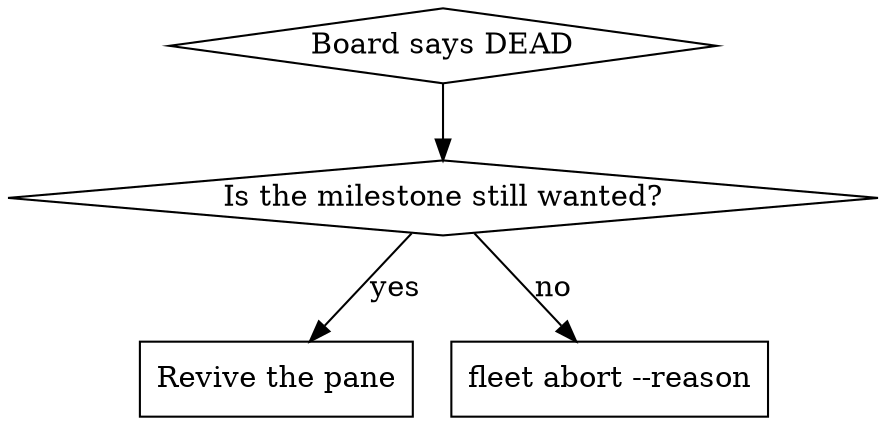

# Reviving Dead Panes

## Overview

A reboot takes the tmux **server** with it. Every dispatched worker's session is gone at once, every
lease is still held, and `fleet board` reads `DEAD` for each one:

> *launched at 2026-08-26T23:00:31Z and no session is alive on tmux server 'fleet-davis': the work
> stopped without renaming its folder*

**`DEAD` is a statement about the process, not about the work.** The instant folder, its `.fleet/` state,
its roadmap claim and the worker's own transcript all survive. Nothing is lost; a pane is missing.

**`DEAD` names the server it asked, and `UNREACHABLE` is a different state with a different remedy.**
`UNREACHABLE` means a live pid holds the slot but no session answered — the work is running and only its
pane is out of reach, so there is nothing to revive. Revive `DEAD`. For `UNREACHABLE`, read the server in
the note; `fleet` follows the record on its own, and the remaining reason to care is that raw `tmux -L`
commands do not.

**No verb revives one.** `fleet resume` adopts an existing *record* and starts nothing. `fleet dispatch`
is the only verb that starts a session, and it would mint a new instant, claim a fresh lease and
re-render the seed — that is a replacement, not a resume, and it discards everything the worker learned.
So revival is done by hand. This skill is the hand procedure and the four traps in it.

**Announce at start:** "I'm using the reviving-dead-panes skill to bring the worker's session back."

**REQUIRED BACKGROUND:** superpowers:using-fleet owns the verb surface, the `pane-guard` contract and the
send-keys rule this skill builds on.

## Decide first: revive, or abandon?



Read the instant's `HANDOFF.md` and its `.fleet/` before choosing. A worker that already recorded an
`abort.json` whose rename never completed is **not** a revival candidate — finish the abort instead;
re-running `fleet abort` over an already-recorded reason completes the rename, the pane close and the
lease release in one call.

## The procedure

`scripts/fleet-revive.sh` derives every value below from the record and writes the launcher. Use it, and
read this section to know what it is doing and why each value is where it is:

```bash
bash scripts/fleet-revive.sh plan        <todo-id>   # every derived value, before anything is created
bash scripts/fleet-revive.sh transcripts <todo-id>   # candidates, newest first — see trap 2
bash scripts/fleet-revive.sh launcher    <todo-id> <transcript-id>
bash scripts/fleet-revive.sh start       <todo-id>
```

By hand, it is this — and **every value is read, never typed**:

```bash
ID=<todo-id>                                          # from `fleet board`
eval "$(fleet status --id "$ID" --porcelain | awk -F'\t' '
  $1=="evidence.tmux"        {print "SESSION=" $2}
  $1=="evidence.tmux_socket" {print "SOCKET="  $2}')"
SLOT=$(fleet leases --porcelain | awk -F'\t' -v i="$ID" '$3==i{print $7}')
tmux -L "$SOCKET" new-session -d -s "$SESSION" -c "$SLOT" /abs/path/to/launch.sh
```

**The socket comes from the record, and there is no default.** Every root has its own tmux server
(`fleet-<name>`), so a hardcoded `fleet` is now wrong everywhere it is not a coincidence. `fleet leases`
carries `slot, lease, todo_id, owner, tmux, claimed_at, path` — the session name and the slot, but **not
the server**; only `fleet status --porcelain` has `evidence.tmux_socket`.

An EMPTY `evidence.tmux_socket` means the record predates the field. That is *not measured*, not "the
default server": find the session before you revive it, with
`for s in $(ls /tmp/tmux-$(id -u)/); do tmux -L "$s" has-session -t "=$SESSION" 2>/dev/null && echo "$s"; done`.

### 1. `new-session` runs the command through `/bin/sh -c`, so a `claude` shell FUNCTION is not there

Where `claude` is a shell function that selects `CLAUDE_CONFIG_DIR` per user before exec'ing the real
binary — the usual arrangement on a shared box — `sh -c` sees only the binary on `PATH`, with
`CLAUDE_CONFIG_DIR` **unset**. The revived worker then reads a different config directory and
`--resume <id>` finds nothing — while the transcript it should have read sits untouched in the
directory it never opened.

Put the exports in a launcher script and give `new-session` that script's absolute path:

```bash
#!/bin/bash
export CLAUDE_CONFIG_DIR=/home/<user>_root/.claude   # the trap: sh -c will not derive this
export FLEET_ROOT=/home/<user>_root                  # the marker supplies store, releases and server
export FLEET_INSTANTS=/abs/path/to/the/effort/instants
export FLEET_TMUX_SOCKET="$SOCKET"                   # the one the RECORD named, not a literal
export INSTANT=/abs/path/to/the/instant
export PATH="$FLEET_ROOT/fleet-releases/current/bin:$PATH"   # the server's PATH is not your PATH
cd "$SLOT"
exec claude --resume <transcript-id>
```

**`FLEET_ROOT`, not `FLEET_HOME`.** Naming the root lets its `.fleet-root` marker supply the store, the
release area and the server, so one line moves if the root does. A literal `FLEET_HOME=$HOME/.fleet` is
the pre-isolation path: it reaches another root's store, or a store that no longer exists.

**Do not name that script `claude` and do not put it on the tmux server's PATH.** That is precisely the
stale-shim shape `dispatch`'s seed-integrity check exists to catch — one such shim once handed a worker
another instant's briefing byte for byte.

### 2. Revive by transcript id, not `--continue`

A slot is re-leased across efforts, so the newest transcript in the slot's project directory is not
reliably the worker you are reviving. One slot here held three, from three occupants weeks apart.

```bash
bash scripts/fleet-revive.sh transcripts <todo-id>    # slug, directory and ordering, derived
```

Pick the id whose mtime matches the death, and pass it to `--resume` explicitly. The script lists and
refuses to choose, because that judgement is the only part of this step that is not mechanical.

### 3. A resumed session opens a MENU, and `pane-guard` reads that menu as unsubmitted text

Past a size threshold the TUI asks how to resume — *Resume from summary / Resume full session as-is /
Don't ask me again* — before it is ready for input. Measured on a 435k-token session: **twelve
consecutive `pane-guard` polls, five seconds apart, all returned `10 queued-text`** while the pane was
showing that menu.

`10` there does **not** mean a human left something in the box. Two consequences:

- **Read the pane before you believe the code.** `10` is not evidence of a boot that finished.
- **The `until … [ $? = 10 ]` submit gate from superpowers:using-fleet falls straight through here.** It
  is designed to wait for text to land in a box; on a booting pane it passes immediately and the `Enter`
  it releases lands on the menu, silently choosing whatever option was highlighted.

### 4. `capture-pane -t "=$SESSION"` fails on a session that EXISTS

A pane target parses as `session:window.pane`, and `=name` alone is not a session part. Measured on tmux
3.2a against one live session:

| target | result |
|---|---|
| `dt-x2ansilinearstack` | rc 0 |
| `=dt-x2ansilinearstack` | rc 1 — **can't find pane** |
| `=dt-x2ansilinearstack:` | rc 0 |

`session.exact_pane_target` appends the colon for exactly this reason and the send-keys recipe inherits
it. An operator typing `capture-pane` by hand reaches for `=name`, gets *can't find pane*, and concludes
the revival failed when it did not.

**Use `fleet_peek "$SESSION"`** from `scripts/fleet-env.sh`, which already gets the target right — and
which refuses when `FLEET_TMUX_SOCKET` is unset rather than falling back to a server you did not name.

### 5. Revive on the server the RECORD names, or the board keeps looking at the old one

A record carries `tmux_socket`, and every verb resolves the session through it — so a pane revived on a
*different* server than the record names is invisible to `board`, `status`, `close` and `abort`, however
healthy it is. This is the one trap that did not exist before per-root isolation, and it is created by the
thing that fixed the others.

Two ways out, and they are not equivalent:

```bash
# Preferred: revive where the record says.
tmux -L "$SOCKET" new-session …          # $SOCKET from evidence.tmux_socket

# Or move the record to where you revived it — `resume` rewrites the server from the shell it runs in.
FLEET_TMUX_SOCKET=<new-server> fleet resume --instant "$INSTANT" --tmux "$SESSION"
```

Prefer the first. The second is correct but it edits the record, and a record that has been re-pointed no
longer agrees with the launcher, the coordinator's runbook or anything else that wrote the old server
down.

## Never send a navigation key on spec

Capture the pane and confirm the menu is actually on screen before sending `Down`, `Up` or `Enter`. A
`Down` sent after the menu had already resolved landed in the input box instead and opened the
slash-command completer on **`/compact`** — one `Enter` away from compacting the very session being
revived. `Escape` clears it.

The general rule: a keystroke aimed at a widget that is not there does not vanish, it hits whatever is.

## Verify, and write nothing

Liveness is **derived**, so the board corrects itself once the process is up — no verb is needed and none
should be run:

```bash
fleet pane-guard --id "$ID"           # 0 = safe; --id resolves the pane on the record's OWN server
fleet board                           # DEAD → the declared phase, by itself
```

**Check with `--id`, not `--pane`.** A bare session name carries no address, so `--pane` asks whichever
server the shell points at and answers `13 unknown-pane` — *this pane does not exist* — about a pane that
is alive on another one. `--id` has the record and follows it.

Measured: a worker went `DEAD` → `AWAITING-CI` with no fleet command run against it. If you find yourself
reaching for `fleet resume` to "re-register" a revived pane, stop — the record never stopped being
correct. Check the board first.

## Common mistakes

| Mistake | Reality |
|---|---|
| `fleet resume` to bring a pane back | It adopts a record and starts no process. The pane is yours to start. |
| `fleet dispatch` to "re-run" the worker | Mints a NEW instant and lease; abandons the transcript. That is replacement. |
| Reading `DEAD` as "the work failed" | It means no session is alive. The folder, `.fleet/` and transcript are intact. |
| Bare `claude` in `new-session` | `sh -c` misses the shell function, so `CLAUDE_CONFIG_DIR` is wrong and `--resume` finds nothing. |
| `claude --continue` | Picks the newest transcript in the cwd, which may belong to a previous occupant of the slot. |
| Trusting `pane-guard 10` during boot | The resume menu reads as queued text. Capture the pane. |
| `capture-pane -t "=$SESSION"` | Not a pane target. Use `=$SESSION:`, or `fleet_peek`. |
| `SOCKET=fleet`, or any literal server | Every root has its own (`fleet-<name>`). Read `evidence.tmux_socket` from the record. |
| Taking the server from `fleet leases` | It has no socket column — `slot, lease, todo_id, owner, tmux, claimed_at, path`. Only `status --porcelain` carries it. |
| Reviving on a server the record does not name | Every verb resolves through the record. The pane runs and the board cannot see it. |
| `pane-guard --pane` to check a revived pane | Asks the ambient server and answers `13` about a live pane elsewhere. Use `--id`. |
| `FLEET_HOME=$HOME/.fleet` in the launcher | The pre-isolation path. Export `FLEET_ROOT` and let the marker supply the rest. |
| Sending `Down`/`Enter` blind | Lands in the input box if the menu is gone; `/compact` is one Enter away. |

## Related tools

- `scripts/fleet-revive.sh` — `plan` / `transcripts` / `launcher` / `start`. Every value derived from the
  record; it creates only the launcher and the session, and it never sends a key.
- `fleet_peek`, `fleet_attach` in `scripts/fleet-env.sh` — the pane target and the `-L` flag, correct.

## Related skills

- superpowers:using-fleet — the verb surface, `pane-guard` codes, and the send-keys contract.
- superpowers:coordinating-instants — you are the coordinator deciding revive-vs-abort.
- superpowers:working-as-a-dispatched-instant — you ARE the worker that just came back.
